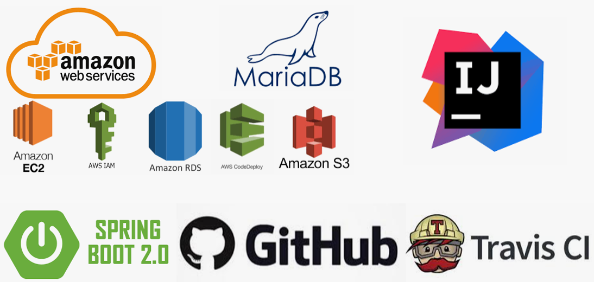
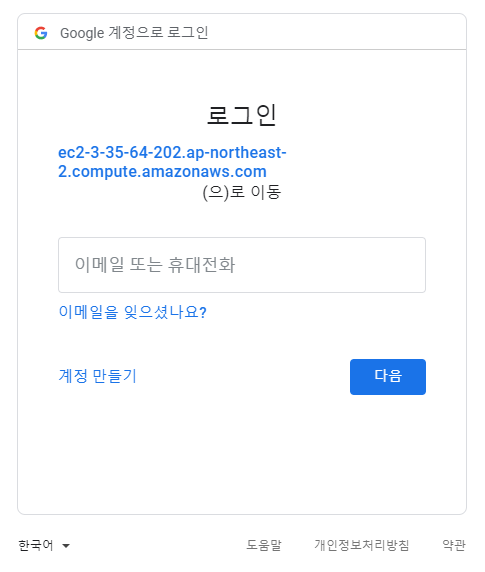
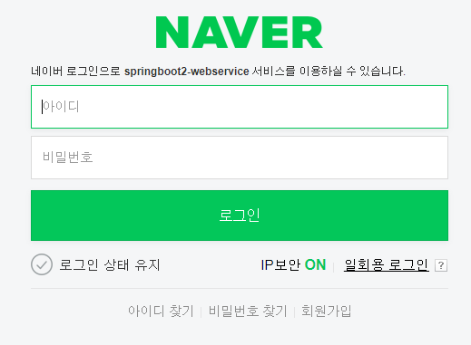
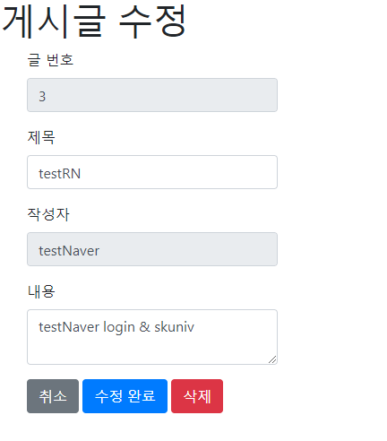

# SpringBoot&AWS Wab_Service
[이동욱](https://jojoldu.tistory.com/539) 님의 스프링 부트와 "[AWS로 혼자 구현하는 웹 서비스](https://www.google.com/search?q=%EC%8A%A4%ED%94%84%EB%A7%81%EB%B6%80%ED%8A%B8%EC%99%80+aws%EB%A1%9C+%ED%98%BC%EC%9E%90+%EA%B5%AC%ED%98%84%ED%95%98%EB%8A%94+%EC%9B%B9%EC%84%9C%EB%B9%84%EC%8A%A4&oq=%EC%8A%A4%ED%94%84%EB%A7%81%EB%B6%80%ED%8A%B8%EC%99%80+AWS&aqs=chrome.0.0l2j69i57j0l2j69i60.14329j1j7&sourceid=chrome&ie=UTF-8)" 를 보면서 공부하였습니다.

**Version**

* Spring Boot 2.4.1
* Gradle 6.7.1
* IntelliJ IDEA 2020.3
* JUnit 5
* MariaDB 10.4.8
* java 8

---

---

### 첫 페이지

### 구글 로그인 구현

### 네이버 로그인 구현

### 글 등록 구현

### 게시글 수정 및 삭제 구현

### [접속 링크](http://ec2-3-35-64-202.ap-northeast-2.compute.amazonaws.com/)

### [정리한 블로그](https://velog.io/@allsser/series/Spring-Boot-AWS-%EB%A1%9C-%EC%9B%B9-%EC%84%9C%EB%B9%84%EC%8A%A4-%EA%B5%AC%ED%98%84)

## INDEX

1. ### [Intellij Springboot start](https://velog.io/@allsser/1.-Intellij-Springboot-start)

2. ### [스프링 부트에서 테스트 코드를 작성](https://velog.io/@allsser/2.-%EC%8A%A4%ED%94%84%EB%A7%81-%EB%B6%80%ED%8A%B8%EC%97%90%EC%84%9C-%ED%85%8C%EC%8A%A4%ED%8A%B8-%EC%BD%94%EB%93%9C%EB%A5%BC-%EC%9E%91%EC%84%B1-4flpf4ty)

3. ### [스프링 부트에서 JPA로 데이터베이스 다루기]

4. ### [머스테치로 화면 구성하기]

5. ### [스프링 시큐리티와 OAuth 2.0으로 로그인 기능 구현]

6. ### [AWS 서버 환경을 만들기 - AWS EC2]

7. ### [AWS에 데이터베이스 환경을 만들기 (AWS RDS)]

8. ### [EC2 서버에 프로젝트를 배포]

9. ### [코드가 푸시되면 자동으로 배포 (Travis CI 배포 자동화)]

10. ### [24시간 365일 중단 없는 서비스 만들기] 
