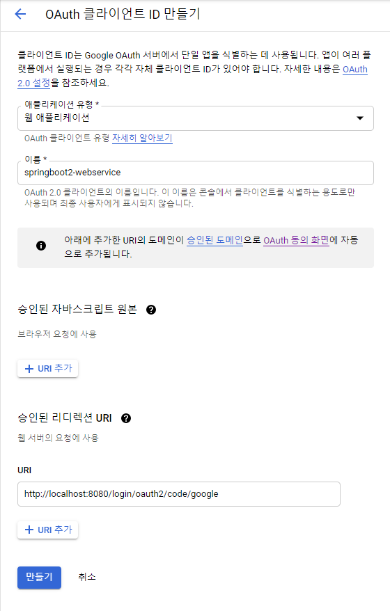

# SpringBoot&AWS Wab_Service

[이동욱](https://jojoldu.tistory.com/539) 님의 스프링 부트와 "[AWS로 혼자 구현하는 웹 서비스](https://www.google.com/search?q=%EC%8A%A4%ED%94%84%EB%A7%81%EB%B6%80%ED%8A%B8%EC%99%80+aws%EB%A1%9C+%ED%98%BC%EC%9E%90+%EA%B5%AC%ED%98%84%ED%95%98%EB%8A%94+%EC%9B%B9%EC%84%9C%EB%B9%84%EC%8A%A4&oq=%EC%8A%A4%ED%94%84%EB%A7%81%EB%B6%80%ED%8A%B8%EC%99%80+AWS&aqs=chrome.0.0l2j69i57j0l2j69i60.14329j1j7&sourceid=chrome&ie=UTF-8)" 를 보면서 공부하였습니다.

**Version**

* Spring Boot 2.4.1
* Gradle 6.7.1
* IntelliJ IDEA 2020.3
* JUnit 5


## INDEX

1. ### [Intellij Springboot start](#1-intellij-springboot-start)

   1.1 [Gradle 프로젝트를 Spring Boot 프로젝트로 변경하기](#11-gradle-프로젝트를-spring-boot-프로젝트로-변경하기)
   
   2.2 [인텔리제이에서 깃과 깃허브 사용하기](#22-인텔리제이에서-깃과-깃허브-사용하기)
   
2. ### [스프링 부트에서 테스트 코드를 작성](#2-스프링-부트에서-테스트-코드를-작성)

   2.1 [테스트 코드 소개](#21-테스트-코드-소개)
   
   2.2 [Hello Controller 테스트 코드 작성하기](#22-Hello-Controller-테스트-코드-작성하기)
   
   2.3 [롬복 소개 및 설치](#23-롬복-소개-및-설치)
   
   2.4 [HelloController 코드를 롬복으로 전환하기](#24-HelloController-코드를-롬복으로-전환하기)
   
3. ### [스프링 부트에서 JPA로 데이터베이스 다루기](#3-스프링-부트에서-JPA로-데이터베이스-다루기)

   3.1 [JPA란?](#31-JPA란)
   
   3.2 [프로젝트에 Spring Data Jpa 적용](#32-프로젝트에-Spring-Data-Jpa-적용)
   
   3.3 [Spring Data JPA 테스트 코드 작성](#33-Spring-Data-JPA-테스트-코드-작성)
   
   3.4 [등록/수정/조회 API 만들기](#34-등록수정조회-api-만들기)
   
   3.5 [JPA Auditing으로 생성시간/수정시간 자동화하기](#35-jpa-auditing으로-생성시간수정시간-자동화하기)
   
4. ### [머스테치로 화면 구성하기](#4-머스테치로-화면-구성하기)

   4.1 [서버 템플릿 엔진과 머스테치](#41-서버-템플릿-엔진과-머스테치)

   4.2 [기본 페이지 만들기](#42-기본-페이지-만들기)

   4.3 [게시글 등록 화면 만들기](#43-게시글-등록-화면-만들기)

   4.4 [전체 조회 화면](#44-전체-조회-화면)

   4.5 [게시글 수정, 삭제 화면](#45-게시글-수정-삭제-화면)

5. ### [스프링 시큐리티와 OAuth 2.0으로 로그인 기능 구현](#5-스프링-시큐리티와-oauth-20으로-로그인-기능-구현)

   5.1 [스프링 시큐리티와 스프링 시큐리티 Oauth2 클라이언트](#51-스프링-시큐리티와-스프링-시큐리티-oauth2-클라이언트)

   5.2 [구글 서비스 등록](#52-구글-서비스-등록)

   5.3 [구글 로그인 연동](#53-구글-로그인-연동)
   
   5.4 [어노테이션 기반으로 개선](#54-어노테이션-기반으로-개선)
   
   5.5 [세션 저장소로 데이터베이스 사용](#55-세션-저장소로-데이터베이스-사용)
   
   5.6 [네이버 로그인](#56-네이버-로그인)
   
   5.7 [기존 테스트에 시큐리티 적용](#57-기존-테스트에-시큐리티-적용)
   
6. ### [AWS 서버 환경을 만들기 - AWS EC2]()

   6.1

---

### 1. Intellij Springboot start

#### 1.1 Gradle 프로젝트를 Spring Boot 프로젝트로 변경하기

* [스프링 이니셜라이저](https://start.spring.io/) 를 통해서 진행하면 편하지만, **build.gradle**를 사용하는 이유는 코드의 역할과 이니셜라이저 외에 추가로 의존성을 추가하는 방법을 배우기 위해서이다.

* Gradle5 -> Gradle6 로 바뀌면서 교재와는 달라진 부분이 있다. [참고 블로그](https://jojoldu.tistory.com/539)

* 버전 업데이트를 하기 위해서 CMD에서 기존 프로젝트가 있는 디렉토리로 이동한 후에 아래 명령어 입력

  > gradlew wrapper --gradle-version 6.7.1
  


**그레이들 프로젝트를 스프링 부트 프로젝트로 변경하기**

```build.gradle
plugins { //(1)
	id 'org.springframework.boot' version '2.4.1'
	id 'io.spring.dependency-management' version '1.0.10.RELEASE'
	id 'java'
}

group '그룹 id' // com.allsser.book
version '1.0.4-SNAPSHOT-'+new Date().format("yyyyMMddHHmmss)
sourceCompatibility = 1.8

repositories {
	mavenCentral()
	jcenter()
}

// for Junit5 가 되면서 추가 되었다.
test { //(2)
	useJUnitPlatform()
}

dependencies {
	// (3)
	implementation(org.springframework.book:spring-boot-starter-web')
	implementation(org.springframework.book:spring-boot-starter-mustache')
	
	// lombok
	implementation('org.projectlombok:lombok')
	annotationProcessor('org.projectlombok:lombok')
	testlmplementation('org.projectlombok:lombok')
	testAnnotationProcessor('org.projectlombok:lombok')
	
	implementation('org.stringframework.boot:spring-boot-starter-data-jpa')
	implementation("org.mariadb.jdbc:mariadb-java-client")
	implementation('com.h2database:h2')
	
	testlmplementation('org.springframework.boot:spring-boot-starter-test')
	
	// Spring Security 권한 부분이다.
	implementation('org.springframework.boot:spring-boot-starter-oauth2-client')
	implementation('org.springframework.session:spring-session-jdbc')
	
	testlmplementation("org.springframework.security:spring-security-test")
}
```

(1) plugins{ ... }

```

plugins {
	id 'org.springframework.boot' version '2.4.1' // Gradle6에서는 RELEASE 삭제
	
	id 'io.spring.dependency-management' version '1.0.10.RELEASE'
	// 스프링 부트의 의존성들을 관리해 주는 플러그인이라 꼭 추가해줘야 한다.
	
	id 'java'
}

repositories { // 각종 의존성 (라이브러리)들을 어떤 원격 저장소에서 받을지를 정한다.
    mavenCentral()
    jcenter() // 라이브러리 업로드 난이도 때문에 jcenter를 많이 쓴다.
    
    // 최근에 나온 jcenter 라이브러리는 업로드 하면 mavenCentral에도 업로드될 수 있도록 자동화를 할 	 // 수 있다.
    // mavenCentral, jcenter 둘 다 등록하여 사용
}
```

(2)  test { ... }

* JUnit5를 사용하기 위해서는 필수로 선언되어야 한다.

(3)  implementation, testlmplementation

* **Gradle 6가 되면서** compile, testCompile은 **Soft Deprecate** 되었다.
* 그대신 implementation, testlmplementation 가 추가되었다.
* 이에 관련된 [참고 블로그](https://jojoldu.tistory.com/538)

```(3)
dependencies { // 프로젝트 개발에 필요한 의존성들을 선언하는 곳이다.
	
	implementation(org.springframework.book:spring-boot-starter-web')
	// 기존 교재에서 사용한던 compile 메소드는 Gradle6 가 되면서 implementation으로 교체하여 사용
	// 하여야 한다.
	
	implementation(org.springframework.book:spring-boot-starter-mustache')
	...
	...
}
```


---

#### 2.2 인텔리제이에서 깃과 깃허브 사용하기

1. 인텔리제이에서 단축키**(Ctrl + Shift + A)**를 사용하여 **Action 검색창**을 열어 **share project on github**을 검색한다.

2. 깃허브 로그인 화면이 나오면 깃허브 계정으로 로인한다. **[Repository name]** 필드에 생성할 저장소 정보를 입력하면 등록한 이름으로 **깃허브 저장소가 생성**된다. (대부분의 프로젝트 이름을 깃허브 저장소와 같은 이름을 사용하니, 같은 이름을 등록하는 것이 좋다.)

3. 맨처음 동기화 과정에서 커밋 항목으로 추가할 것인지 묻는 안내문이 나올 경우 **No**을 선택한다. 그럼 프로젝트의 첫 번째 커밋을 위한 팝업창이 등장한다.

4. 팝업창에서 **.idea 디렉토리는 커밋하지 않는다.** 이유는 인텔리제이에서 프로젝트 **실행시 자동으로 생성되는 파일들**이기 때문에 깃허브에 올리기에는 불필요 하다.

5. .idea 폴더를 앞으로의 **모든 커밋 대상에서 제외되도록 처리하는 방법**은 **.gitignore 파일**을 사용한다. .gitignore 파일은 "이 파일 안에 기입된 내용들은 모두 깃에서 관리하지 않겠다."를 의미한다.

6. .gitignore 플러그인을 설치하기 위해서 단축키**(Ctrl + Shift + A)**를 사용하여 **Action 검색창**을 열어 **plugins**을 검색해서 플러그인을 열어 **Marketplace** 탭에서 **.ignore**을 검색하여 설치해준다. (**인텔리제이를 다시 시작해야만 설치한 플러그인이 적용된다.**)

7. 왼쪽 위의 프로젝트 오른쪽 클릭하거나 단축키**(Alt + Insert)**를 눌러 생성 목록을 열고나서 생성 목록 아래에 **[.ignore file -> gitignore file(Git)]**을 선택하여 .gitignore 파일을 생성시켜 준다.

8. 생성된 .gitignore 파일에 깃 체크 대상에서 제외하고 싶은 이름을 작성하면 된다.

   > .gradle
   >
   > .idea

9.  깃 커밋 창을 여는 단축키**(Ctrl + K)**를 눌러 커밋 메시지를 작성 후 푸쉬**(Ctrl + Shift + K)**를 해주면 된다.


----

### 2. 스프링 부트에서 테스트 코드를 작성

* 최근 대부분의 서비스 회사가 테스트 코드에 관해 요구를 하고 있다.

  

#### 2.1 테스트 코드 소개

* **TDD : 테스트가 주도하는 개발**

* **단위 테스트(Unit Test) : 테스트 코드를 먼저 작성**


**단위 테스트 코드를 작성하는 이유?**

> * 단위 테스트는 개발단계 초기에 문제를 발견하게 도와준다.
> * 단위 테스트는 개발자가 나중에 코드를 리팩토링하거나 라이브러리 업그레이드 등에서 기존 기능이 올바르게 작동하는지 확인할 수 있다.
> * 단위 테스트는 기능에 대한 불확실성을 감소시킬 수 있다.
> * 단위 테스트는 시스템에 대한 실제 문서를 제공한다. 즉, 단위 테스트 자체가 문서로 사용할 수 있다.


**단위 테스트 코드를 사용하면 좋은 이유**

> * 코드 수정시 톰켓을 계속 올렸다 내렸다 할 필요가 없다. -> 테스트 코드를 사용하면 **자동검증**이 가능하다.
> * 개발자가 만든 기능을 안전하게 보호해준다.
> * 테스트 코드를 사용하면 문제를 조기에 찾을 수 있다.


**테스트 프레임워크로는 xUnit가 있다. 이는 개발환경(x)에 따라 Unit 테스트를 도와주는 도구라 생각하면 된다.**

>* JUnit - Java
>* DBUnit -DB
>* CppUnit - C++
>* NUnit - .net


#### 2.2 Hello Controller 테스트 코드 작성하기

1. 패키지 안에 있는 Java 디렉토리에 새로운 패키지**(New -> Package)**를 생성한다. 일반적으로  패키지 명은 **웹 사이트 주소의 역순**으로 한다. Ex) book.allsser.com(사이트의 주소 보통 Group Id 이다.)이라면 패키지 명은 com.allsser.book 이다. 최종적으로 springboot라는 프로젝트 명을 사용하여 com.allsser.book.springboot가 된다.

2. 새로 만든 패키지(com.allsser.book.springboot) 아래에 Java 클래스를 생성한다. 클래스의 이름은 Application으로 한다.

   

3. 아래와 같이 코드를 작성해 준다.

   ```Application
   import org.springframework.boot.SpringApplication;
   import org.springframework.boot.autoconfigure.SpringBootApplication;
   
   @SpringBootApplication	// {1}
   public class Application {
   	public static void main(String[] args) {
   		SpringApplicaiton.run(Application.class, args);	// {2}
   	}
   }
   ```
   
   
   
   * **Application 클래스**는 앞으로 만들 프로젝트의 **메인 클래스**이다.
   * {1} **@SpringBootApplication**으로 인해 스프링 부트의 자동 설정, 스프링 **Bean** 일기와 생성을 자동으로 설정된다.
   * {1}**@SpringBootApplication 이 있는 위치부터 설정을 읽기** 때문에 항상 **프로젝트 최상단에 위치하고 있어야 한다.**
* {2}main 메소드에서 실행하는 **SpringApplication.run**으로 인해 내장 *WAS를 실행시켜 준다.
  
```WAS
   WAS(Web Application Server, 웹 애플리케이션 서버)
   -내장 WAS란 외부에 WAS를 두지 않고 애플리케이션을 실행할 때 내부에서 WAS를 실행하는 것을 뜻한다.
   -이렇게 하면 항상 서버에 톰켓을 설치할 필요가 없어지게 되고, 스프링 부트로  만들어진 Jar 파일로 실행하면 된다.
   -내장 WAS를 사용하면 '언제 어디서나 같은 환경에서 스프링 부트를 배포'할 수 있다.
```

   

4. 테스트를 위한 **Controller**를 만들어야 한다. 위에 만든 패키지 하위에 **web 패키지를 만들어 준다.

   

   web 패키지 안에 **컨트롤러와 관련된 클래스들은 모두 이 패키지** 안에서 관리해 준다.

   

5. HelloController 라는 이름의 클래스를 만들어 준다.

   생성됬으면 간단한 API를 생성해 준다.

   ```HelloController
   import org.springframework.web.bind.annotation.GetMapping;
   import org.springframework.web.bind.annotation.RestController;
   
   @RestController	// {1}
   public class HelloController {
   
   	@GetMapping("/hello")}	// {2}
   	public String hello() {
   		return "hello";
   	}
   }
   ```

   

   * {1} **RestController**
     * 컨트롤러를 JSON을 반환하여 컨트롤러로 만들어 준다.
     * 예전에는 @ResponseBody를 각 메소드마다 선언했던 것을 한번에 사용할 수 있게 해준다.
     
   * {2} **GetMapping**

     * HTTP Method인 Get의 요청을 받을 수 있는 API를 만들어 준다.
     * 이 프로젝트는 /hello로 요청이 오면 문자열 hello를 반환하는 기능을 가지게 되었다.

     

6. 테스트 코드를 검증하기 위해 main 디렉토리가 이난 test 디렉토리로 가서 위와 같이 com.allsser.book.springboot를 생성해 준다.

   

   

7. 생성된 클래스에 아래와 같이 테스트 코드를 추가해 준다.

   ```HelloControllerText
   import org.junit.jupiter.api.Test;	// {1}
   import org.junit.jupiter.api.extension.ExtendWith;
   import org.springframework.beans.fectory.annotation.Autowired;
   import org.springframework.boot.test.autoconfigure.web.servlet.WebMvcTest;
   import org.springframework.test.context.junit.jupiter.SpringExtension;
   import org.springframework.test.web.servlet.MockMvc;
   
   import static org.springframework.test.web.servlet.request.MockMvcRequestBuilders.get;
   import static org.springframework.test.web.servlet.result.MockMvcResultMatchers.content;
   import static org.springframework.test.web.servlet.result.MockMvcResultMatchers.status;
   
   @Extend(SpringExtension.class)	// {2}
   @WebMvcTest(controllers = HelloController.class)	// {3}
   public class HelloControllerTset {
   
   	@Autowired	// {4}
   	private MockMvc mvc;	// {5}
   	
   	@Test
   	public void hello_to_return() throws Exception {
   		String hello = "hello";
   		
   		mvc.perform(get("/hello"))		// {6}
   				.andExpect(status().isOk())		// {7}
   				.andExpect(content().string(hello));	//{8}
   	}
   }
   ```

   * {1} **.Tset** 

     * JUnit4 에서 JUnit5로 넘어오면서 달라졌다.(교재에서는 JUnit4 사용, 현재 프로젝트는 JUnit5)
     * import 패키지 : org.junit.Test (JUnit4) -> **org.junit.jupiter.api.Tset (JUnit5)**

   * {2} **@Extend(SpringExtension.class)**

     * 어노테이션 : @RunWith (Junit4) -> **@Extend(JUnit5)**
     * import 패키지 : org.junit.runner.RunWith (Junit4) -> **org.junit.jupiter.api.extension.ExtenWith (JUnit5)**
     * 테스트를 진행할 떄 Junit에 내장된 실행자 외에 다른 실행자를 실행시킨다.
     * 여기서는 **SpringExtension (JUnit)** 라는 스프링 실행자를 사용한다. (SpringRunner (Junit4))
     * 즉, 스프링 부트 테스트와 JUnit 사이에 연결자 역할을 한다.

   * {3} **@WebMvcTest**

     * 여러 스프링 테스트 어노테이션 중, Web(Spring MVC)에 집중할 수 있는 어노테이션이다.
     * 선언할 경우 @Controller, @ControllerAdvice 등을 사용할 수 있다.
     * 단, @Service, @Component, @Repository 등은 사용할 수 없다.
     * 어기서는 컨트롤러만 사용하기 때문에 선언한다.

   * {4} **@Autowired**

     * 스프링이 관리하는 빈(bean)을 주입 받는다.

   * {5} **private MockMvc mvc**

     * 웹 API를 테스트할 때 사용한다.
     * 스프링 MVC 테스트의 시작점이다.
     * 이 클래스를 통해 HTTP GET, POST 등에 대한 API 테스트를 할 수 있다.

   * {6} **mvc.perfrom(get("/hello"))**

     * MockMvc를 통해 /hello 주소로 HTTP GET 요청을 한다.
     * 체이닝이 지원되어 아래와 같이 여러 검증 기능을 이어서 선언할 수 있다.

   * {7} **.andExpect(status().isOk())**

     * mvc.perform의 결과를 검증한다.
     * HTTP Header의 Status를 검증한다.
     * 우리가 흔히 알고 있는 200, 404, 500 등의 상태를 검증한다.
     * 여기서는 OK 즉, 200인지 아닌지를 검증한다.

   * {8} **.andExpect(content().string(hello))**

     * mvc.perform의 결과를 검증한다.
     * 응답 본문의 내용을 검증한다.
     * Controller에서 "hello"를 리턴하기 때문에 이 값이 맞는지 검증한다.

     

   (JUnit4 -> JUnit5 변경된 사항 [참고 블로그](https://jojoldu.tistory.com/539))

   

8. 테스트 코드 실행

   

   메소드의 왼쪽 화살표를 클릭하여 실행한다.

   

   

   테스트 코드가 성공하면 다음과 같이 나온다.

   

9. 수동으로 실행하여 정상적인 값 출력하기

   * Application.java 파일로 이동하여 **main 메소드의 왼쪽 화살표 버튼을 클릭**해 준다.

   

   * 실행해 보면 톰캣 서버가 8080 포트로 실행된 것을 로그에서 확인할 수 있다.

     

   * **localhost:8080/hello**로 접속하면 hello가 잘 나오는 것을 확인할 수 있다.

     

   * 테스트 코드의 결과와 같은 것을 확인할 수 있다. **테스트 코드는 꼭 따라 해야 한다.**그래야 견고한 소프트웨어를 만들수 있다. 절대 **수동으로 검증하고 테스트 코드를 작성하진 않는다.**
   * 교재 버전과 현재 실습 버전과 다르다. 만약, 교재 그대로 실습을 진행하게 되면 수동으로 실행시 localhost:8080/hello 로 접속하게 되면 "아이디와 비번을 쳐서 접속하라는 로그인 창"이 뜬다. (이거 버전때문인지 모르고 교재 그대로 진행했다가 로그인 창이 게속 열려서 고생했다. 버전 중요!!)


#### 2.3 롬복 소개 및 설치

* **자바 개발자들의 필수 라이브러리 롬복**

* 롬복은 자바 개발할 때 자주 사용하는 코드 **Getter, Setter, 기본생성자, toString 등**을 어노테니션으로 자동 생성해 준다.

* build.gradle에 **implementation('org.projectlombok:lombok')** 코드를 추가해 준다.

  

  ​			Refresh로 새로고침해서 라이브러리(의존성이라고도 한다)를 내려 반는다.

* 롬복을 설치하는 방법은 **플러그인 Action을 검색한다.(Ctrl + Shitf + A)**창이 열리면 **Plugins**를 검색하여 **Marketplace**로 이동하여 **"lombok"**을 검색한다. 검색결과에서 나온 **Lombok Plugin**버튼을 눌려 설치해 준다.

* 마지막으로 **Enable annotation processing**을 체크해 준다.


* 롬복은 프로젝트마다 설정해야 한다. 플러그인 설치는 한번만 하면 되지만, build.gradle에 라이브러리를 추가하는 것과 Enable annotation processing를 체크하는 것은 프로젝트마다 진행해야 한다.
* 롬복 설정을 했으니 이제 기존 코드를 **롬복으로 리팩토링**해준다.


#### 2.4 HelloController 코드를 롬복으로 전환하기

* **테스트 코드가 우리의 코드를 지켜주기 때문에** 롬복으로 변경하고 문제가 생기는지 돌려보면 알 수 있다.


1. web 패키지에 dto 패키지를 추가해 준다. 앞으로 **모든 응답 Dto는 이 Dto 패키지에 추가**하겠다. 이 패키지에 HelloResponseDto를 생성해 준다.

   

   

   HelloResponseDto 코드를 작성해 준다.

   ```HelloResponseDto
   import lombok.Getter;
   import lombok.RequiredArgsConstructor;
   
   @Getter	// {1}
   @RequiredArgsConstructor	// {2}
   public class HelloResponseDto {
   
   	private final String name;
   	private final int amount;
   
   }
   ```

   * {1} **@Getter**
     * 선언된 모든 필드의 get 메소드를 생성해 준다.
   * {2} **@RequiredArgsConstructor**
     * 선언된 모든 final 필드가 포함된 생성자를 생성해준다.
     * final이 없는 필드는 생성자에 포함되지 않는다.

   

2.  이 Dto에 적용된 롬복이 잘 작동하는지 간단한 테스트 코드를 작성한다.

   * 테스트 코드의 작성은 위와 같이  똑같은 패키지를 추가해주고 작성한다.

     

   * HelloRespnseDtoTest 클래스의 코드를 추가해 준다.

     ```HelloResponseDtoTest
     import org.junit.Tset;
     import static org.assertj.core.api.Assertions.assertThat;
     
     public class HelloResponseDtoTest {
     	
     	@Test
     	public void 롬복_기능_테스트() {
     		//given
     		String name = "test";
     		int amount = 1000;
     		
     		//when
     		HelloResponseDto dto = new HelloResponseDto(name, amount);
     		
     		//then
     		assertThat(dto.getName()).isEqualTo(name);	// {1}, {2}
     		assertThat(dto.getAmount()).isEqualTo(amount);
     	}
     }
     ```

   * {1} **assertThat**

     * assertj라는 테스트 검증 라이브러리의 검증 메소드이다.
     * 검증하고 싶은 대상을 메소드 인자로 받는다.
     * 메소드 체이닝이 지원되어 isEqualTo와 같이 메소드를 이어서 사용할 수 있다.

   * {2} **isEqualTo**

     * assertj의 동등 비교 메소드이다.
     * assertThat에 있는 값과 isEqualTo의 값을 비교해서 같을 때만 성공이다.

   * 테스트 결과

     

   * 정상적으로 기능을 수행하는 것을 확인해 볼 수 있다. 롬복의 **@Getter**로 **get 메소드**가, **@RequiredArgsConstructor**로 생성자가 자동으로 생성되는 것이 증명되었다.

     

3.  HelloController에도 새로 만든 ResponseDto를 사용하도록 코드를 추가해 준다.

   ```HelloController
   @GetMapping("/hello/dto")
   public HelloResponseDto helloDto(@RequestParam("name") String name,	// {1}
   								 @RequestParam("amount") int amount) {
   								 
   	return new HelloResponseDto(name, amount);
   	
   }
   ```

   * {1} **@RequestParam**

     * 외부에서 API로 넘긴 파라미터를 가져오는 어노테이션이다.
     * 여기서는 외부에서 name (@RequestParam("name")) 이란 이름으로 파라미터를 메소드 파라미터 name(String name)에 저장하게 된다.

   * name과 amount는 API를 호출하는 곳에서 넘겨준 값들이다. 추가된 API를 테스트 하는 코드를 HelloControllerTest에 추가한다,

     ```HelloControllerTest
     import org.junit.jupiter.api.Test;
     import org.junit.jupiter.api.extension.ExtendWith;
     import org.springframework.beans.factory.annotation.Autowired;
     import org.springframework.boot.test.autoconfigure.web.servlet.WebMvcTest;
     import org.springframework.test.context.junit.jupiter.SpringExtension;
     import org.springframework.test.web.servlet.MockMvc;
     
     import static org.hamcrest.Matchers.is;
     import static org.springframework.test.web.servlet.request.MockMvcRequestBuilders.get;
     import static org.springframework.test.web.servlet.result.MockMvcResultMatchers.*;
     
     @ExtendWith(SpringExtension.class)
     @WebMvcTest(controllers = HelloController.class)
     public class HelloControllerTest {
     
         @Autowired
         private MockMvc mvc;
     
         @Test
         public void hello_to_return() throws Exception {
             String hello = "hello";
     
             mvc.perform(get("/hello"))
                     .andExpect(status().isOk())
                     .andExpect(content().string(hello));
         }
     
         @Test
         public void helloDto가_리던된다() throws Exception {
             String name = "hello";
             int amount = 1000;
     
             mvc.perform(get("/hello/dto")
             		.param("name", name)	// {1}
             		.param("amount", String.valueOf(amount)))
                     .andExpect(status().isOk())
                     .andExpect(jsonPath("$.name", is(name)))	// {2}
                     .andExpect(jsonPath("$.amount", is(amount)));
         }
     }
     ```

   * {1} **param**

     * API 테스트할 때 사용할 요청 파라미터를 설정한다.
     * 단, 값은 String만 허용한다.
     * 그래서 숫자/날짜 드으이 데이터도 등록할 때는 문자열로 변경해야만 가능하다.

   * {2} **jsonPath**

     * JSON 응답값을 필드별로 검증할 수 있는 메소드이다.
     * $를 기준으로 필드명을 명시한다.
     * 여기서는 name과 amount를 검증하니 $.name, $.amount로 검증한다.

   * 테스트 실행 결과 JSON이 리턴되는 API 역시 정상적으로 테스트가 통과하는 것을 확인할 수 있다.

      


---

### 3. 스프링 부트에서 JPA로 데이터베이스 다루기

* 보통 스프링을 배울 때 MyBatis(iBatis)와 같은 SQL Mapper를 이용하여 테이터베이스 쿼리를 작성했다. 그러다 보니 실제로 개발하는 시간보다 SQL을 다루는 시간이 더 많을 경우도 있다.
* 위의 문제를 해결하기 위해 **JPA라는 자바 표준 ORM(Object Relational Mapping)**기술을 사용하게 되었다.
* **ORM**은 **객체를 매핑**하는 것이고, **SQL Mapper(MyBatis, iBatis)**는 **쿼리를 매핑**한다.
* 아직 SI 환경에서는 **Spring & MyBatis**를 많이 사용하지만, 자사 서비스를 개발하는 곳에서는 **SpringBoot & JPA**를 전사 표준으로 사용하고 있다. 기존 프로젝트 환경을 개편하는 곳들도 대부분 JPA를 선택하고 있다.


#### 3.1 JPA란?

* 현대의 웹 애플리케이션에서 **관계형 데이터베이스(RDB, Relational Database)**는 빠질 수 없는 요소이다. **Oracle, MySQL, MSSQL** 등을 쓰지 않는 애플리케이션은 거의 없다. 그러다 보니 **객체를 관계형 데이터베이스에서 관리**하는 것이 무엇보다 중요하다.
* 현업 프로젝트의 대부분이 **애플리케이션 코드보다 SQL**로 가득 차 있다. 이는 관계형 데이터베이스가 SQL만 가능하니 각 테이블마다 기본적인 **CRUD(Create, Read, Update, Delete) SQL**을 매번 생성해야 한다.
* 이러다보니 자바 클래스를 아름답게 설계해도, SQL을 통해서만 데이터베이스에 저장하고, 조회할 수 있다. 결국, 관계형 데이터베이스를 사용해야만 하는 상황에서 **SQL은 피할 수 없다.**
* 단순 반복 작업의 문제 외에도 **패러다임 불이치** 문제가 있다. 관계형 데이터베이스는 **어떻게 데이터를 저장**할지에 초점이 맞춰진 기술이고, 반대로 객체지향 프로그래밍 언어는 메시지를 기반으로 **기능과 속성을 한 곳에서 관리**하는 기술이다. 관계형 데이터베이스와 객체지향 프로그래밍 언어의 패러다임이 서로 다른데, 객체를 데이터베이스에 저장하려고 하니 여러 문제가 발생한다. 이를 **패러다임 불이치**라고 한다.
* **JAP**가 이런 문제점을 해결하기 위해 등장했다. 서로 지향하는 바가 다른 2개 영역을 **중간에서 패러다임 일치**를 시켜주기 위한 기술이다.
* 즉, 개발자는 **객체지향적으로 프로그래밍을 하고**, JPA가 이를 관계형 데이터베이스에 맞게 SQL을 대신 생성해서 실행한다. 개발자는 항상 객체 지향적으로 코드를 표현할 수 있으니 더는 **SQL에 종속적인 개발을 하지 않아도 된다.**


**3.1.1 Spring Data JPA**

* JPA는 인터페이스로서 자바 표준명세서이다. 인터페이스인 JPA를 사용하기 위해서는 구현체가 필요하다. 대표적으로 Hibernate, Eclipse Link 등이 있다. 하지만 Spring에서 JPA를 사용할 때는 이 구현체들을 직접다루지 않는다.
* 구현체들을 좀 더 쉽게 사용하고자 추상화시킨 **Spring Data JPA**라는 모듈을 이용하여 JPA 기술을 다룬다.
  * 관계 JPA <- Hibernate <- Spring Data JPA
* Hibernate를 쓰는 것과 Spring Data JPA를 쓰는 것 사이에는 큰 차이가 없다. 그러나 스프링 진영에서는 Spring Data JPA를 개발했고, 이를 권장하고 있다. 이렇게 한 단계 더 감싸놓은 Spring Data JPA가 등장한 이유는 두 가지가 있다.
  * 구현체 교체의 용의성 - Hibernate 외에 다른 구현체로 쉽게 교체하기 위함이다.
  * 저장소 교체의 용의성 - 관계형 데이터베이스 외의 다른 저장소로 쉽게 교체하기 위함이다.


**3.1.2 실무에서 JPA**

* 실무에서 **높은 러닝 커브** 때문에 JPA를 사용하지 못한다. JPA를 잘 쓰려면 **객체지향 프로그래밍과 관계형 데이터베이스**를 둘 다 이해해야 하기 때문이다.
* JPA를 사용하면 이득이 크다. **CRUD 쿼리를 직접 작성할 필요가 없고, 부모-자식 관계 표현, 1:N 관계 표현, 상태와 행위를 한 곳에서 관리하는 등 객체지향 프로그래밍을 쉽게**할 수 있다.
* JPA에서 여러 성능 이슈 해결책들을 이미 준비해놓은 상태이기 때문에 이를 잘 활용하면 네이티브 쿼리만큼의 퍼포먼스를 낼 수 있다.


#### 3.2 프로젝트에 Spring Data Jpa 적용

* 먼저 build.gradle에 다음과 같이 **org.springframework.boot:spring-boot-starter-jpa**와 **com.h2.database:h2** 의존성들을 등록한다.

  ```build.gradle
  dependencies {
  	implementation('org.springframework.boot:spring-boot-starter-data-jpa')	// {1}
  	implementation('com.h2database:h2')	// {2}
  }
  ```

  * {1} **spring-boot-starter-data-jpa**
    * 스프링 부트용 Spring Data Jpa 추상화 라이브러리이다.
    * 스프링 부트 버전에 맞춰 자동으로 JPA관련 라이브러리들의 버전을 관리해 준다.
  * {2} **h2**
    * 인메모리 관계형 데이터베이스이다.
    * 별도의 설치가 필요 없이 프로젝트 의존성만으로 관리할 수 있다.
    * 메모리에서 실행되기 때문에 애플리케이션을 재시작할 때마다 초기화된다는 점을 이용하여 테스트 용도로 많이 사용된다.
    * 이 프로젝트에서는 JPA의 테스트로 로컬 환경에서의 구동에서 사용할 예정이다.

* 의존성이 등록되었다면, JPA 기능을 사용해 보자. **domain 패키지**를 추가해 준다.

  

  * 이 domain 패키지는 **도메인을 담을 패키지**이다. 여기서 도메인이란 **게시글, 댓글, 회원, 정산, 결제 등 소프트웨어에 대한 요구사항 혹은 문제 영역**이라고 생각하면 된다.
  * 기존에 MyBatis와 같은 쿼리 매퍼를 사용했다면 dao 패키지를 떠올리겠지만, dto 패키지와는 조금 결이 다르다고 생각하면 된다. xml에 쿼리를 담고, 클래스는 오직 쿼리의 결과만 담던 일들이 모두 **도메인 클래스라고 불리는 곳에서 해결**된다.

* domain 패키지에 **posts 패키지와 Posts 클래스**를 만들어 준다.

  
  * Posts 클래스 코드

  ```Posts
  import lombok.Builder;
  import lombok.Getter;
  import lombok.NoArgsConstructor;
  
  import javax.persistence.*;
  
  @Getter	// {6}
  @NoArgsConstructor	// {5}
  @Entity	// {1}
  public class Posts {
  
  	@Id	// {2}
      @GeneratedValue(strategy = GenerationType.IDENTITY)	// {3}
      private Long id;
  
      @Column(length = 500, nullable = false)	// {4}
      private String title;
  
      @Column(columnDefinition = "TEXT", nullable = false)
      private String content;
  
      private String author;
  
      @Builder	// {7}
      public Posts(String title, String content, String author) {
          this.title = title;
          this.content = content;
          this.author = author;
      }
  }
  ```

  *  @Entity는 JPA의 어노테이션이며, @Getter, @NoArgsConstructor는 롬복의 어노테이션이다. 위와 같이 주요 어노테이션인 @Entity 위에 롬복 어노테이션들을 놓았다. 이렇게 하면 이후 **코틀린 등의 새 언어 전환으로 롬복이 더이상 필요 없을 경우** 쉽게 삭제할 수 있다.

  * **Posts 클래스**는 **실제 DB의 테이블과 매칭될 클래스**이며 보통 **Entity 클래스**라고도 한다. JPA를 사용하면 DB 데이터에 작업할 경우 실제 쿼리를 날리기보다는, 이 Entity 클래스의 수정을 통해 작업을 한다.

  * {1} **@Entity (JPA)**

    * 테이블과 링크될 클래스임을 나타낸다.
    * 기본값으로 클래스의 카멜케이스 이름을 언더스코어 네이밍(_)으로 테이블 이름을 매칭한다.
    * ex) SalesManager.java -> sales_manager table

  * {2} **@Id (JPA)**

    * 해당 테이블의 PK 필드를 나타낸다.

  * {3} **@GeneratedValue (JPA)**

    * PK의 생성 규칙을 나타낸다.
    * 스프링 부트 2.0 에서는 GenerationType.IDENTITY 옵션을 추가해야만 auto_increment가 된다.

  * {4} **@Column (JPA)**

    * 테이블의 칼럼을 나타내며 굳이 선언하지 않더라도 해당 클래스의 필드는 모두 칼럼이 된다.
    * 사용하는 이유는, 기본값 외에 추가로 변경이 필요한 옵션이 있으면 사용한다.
    * 문자열의 경우 VARCHAR(255)가 기본값인데, 사이즈를 500으로 늘리고 싶거나(ex: title), 타입을 TEXT로 변경하고 싶거나(ex: content) 등의 경우에 사용한다.

  * {5} **@NoArgsConstructor (lombok)**

    * 기본 생성사 자동 추가
    * public Posts() {} 와 같은 효과

  * {6} **@Getter (lombok)**

    * 클래스 내 모든 필드의 Getter 메소드를 자동생성

  * {7} **@Builder (lombok)**

    * 해당 클래스의 빌더 패턴 클래스를 생성
    * 생성자 상단에서 선언 시 생성자에 포함된 필드만 빌더에 포함

  * 이 Posts 클래스에는 한 가지 특이점이 있는데, 바로 **Setter 메소드가 없다**는 점이다. 자바빈 규약을 생각하면서 **getter/setter를 무작정 생성**하는 경우가 있다. 이렇게 되면 해당 클래스의 인스턴스 값들이 언제 어디서 변해야 하는지 코드상으로 명확하게 구분할 수 없어, 차후 기능 변경 시 정말 복잡해 진다.

  * 그래서 **Entity 클래스에서는 절대 Setter 메소드를 만들지 않는다.** 대신. 해당 필드의 값 변경이 필요하면 명확히 그 목적과 의도를 나타낼 수 있는 메소드를 추가해야 한다.

    ex) 주문 취소 메소드

  ```Oder
  // 잘못된 사용 예
  public class Order{
  	public void setStatus(boolean status){
  		this.status = status
  	}
  }
  
  public void 주문서비스의_취소이벤트() {
  	order.setStatus(false);
  }
  --------------------------------------------------------------------------------------
  // 올바른 사용 예
  public class Order{
  	public void cancelOrder() {
  		this.status = false;
  	}
  }
  
  public void 주문서비스의_취소이벤트() {
  	order.cencelOrder();
  }
  ```

  * **Setter가 없는 상황에서 어떻게 값을 채워 DB에 삽입(Inset)해야 할까?** 생성자 대신 **@Builder를 통해 제공되는 빌더 클래스**를 상용한다. 생성자난 빌더나 생성자 시점에 값을 채워주는 역할은 똑같다.

* Posts 클래스 생성이 끝나면, Posts 클래스로 Database를 접근하게 해줄 **JapRepository**를 생성해 준다.

  

  ```PostsRepository
  import org.springframework.data.jpa.repository.JapRepository;
  
  pulic interface PostsRepository extends JpaRepository<Posts, Long> {
  
  }
  ```

  * 보통 ibatis나 MyBatis 등에서 Dao라고 불리는 DB Layer 접근자이다.
  * JPA에선 **Repository**라고 부르며 **인터페이스**로 생성한다. 인터페이스 생성후, **JpaRepository<Entity 클래스, PK 타입>**를 상송하면 기본적인 **CRUD 메소드가 자동적으로 생성**된다.
  * **@Repository를 추가할 필요도 없다.** 여기서 주의할 점은 **Entity 클래스와 기본 Entity Repository는 함께 위치**해야 한다.


#### 3.3 Spring Data JPA 테스트 코드 작성

* test 디렉토리에 domain.posts 패키지를 생성하고, 테스트 클래스는 PostsRepositoryTest란 이름으로 생성한다.

  

* PostsRepositoryTest에서는 다음과 같이 **save, findAll** 기능을 테스트 한다.

  ```PostsRepositoryTest
  import com.allsser.book.springboot.domain.posts.Posts;
  import com.allsser.book.springboot.domain.posts.PostsRepository;
  import org.junit.jupiter.api.AfterEach;
  import org.junit.jupiter.api.Test;
  import org.junit.jupiter.api.extension.ExtendWith;
  import org.springframework.beans.factory.annotation.Autowired;
  import org.springframework.boot.test.context.SpringBootTest;
  import org.springframework.test.context.junit.jupiter.SpringExtension;
  
  import java.util.List;
  
  import static org.assertj.core.api.Assertions.assertThat;
  
  @ExtendWith(SpringExtension.class)
  @SpringBootTest
  public class PostsRepositoryTest {
  
      @Autowired
      PostsRepository postsRepository;
  
      @AfterEach	// {1}
      public void cleanup() {
          postsRepository.deleteAll();
      }
  
      @Test
      public void 게시글저장_불러오기() {
          // given
          String title = "테스트 게시글";
          String content = "테스트 본문";
  
          postsRepository.save(Posts.builder()	//	{2}
                  .title(title)
                  .content(content)
                  .author("allsser@naver.com")
                  .build());
  
          //  when
          List<Posts> postsList = postsRepository.findAll();	// {3}
  
          // then
          Posts posts =postsList.get(0);
          assertThat(posts.getTitle()).isEqualTo(title);
          assertThat(posts.getContent()).isEqualTo(content);
      }
  }
  ```

  * {1} **@AfterEach**

    * 어노테이션 : @After (JUnit4) -> **@AfterEach (JUnit5)**
    * import 패키지 : org.junit.After (JUnit4) -> **org.junit.jupiter.api.AfterEach (JUnit5)**
    * JUnit에서 단위 테스트가 끝날 떄마다 수행되는 메소드를 지정
    * 보통은 배포 전 전체 테스트를 수행할 때 테스트간 데이터 침범을 막기 위해 사용한다.
    * 여러 테스트가 동시에 수행되면 테스트용 데이터베이스인 H2에 데이터가 그대로 남아 있어 다른 테스트 실행 시 테스트가 실패할 수 있다.

  * {2} **postsRepository.save**

    * 테이블 posts에 insert/update 쿼리를 실행한다.
    * id 값이있다면 update가, 없다면 insert 쿼리가 실행된다.

  * {3} **postsRepository.findAll**

    * 테이블 posts에 있는 모든 데이터를 조회해오는 메소드이다.

  * 별다른 설정 없이 **@SpringBootTest**를 사용할 경우 **H2 데이터베이스**를 자동으로 실행해 준다.

    

* 테스트 결과

  


* 실제로 실행된 쿼리의 형태 확인하기

  * 스프링 부트에서 쿼리 로그를 확인하기 위해 **application.properties, application.yml 등**의 파일로 **한 줄의 코드로 설정**할 수 있도록 지원하고 있다.

  * src/main/resources 디렉토리 아래에 application.properties 파일을 생성한다.

    

  * application.properties에 옵션을 추가해 준다.

    > spring.jpa.show_sql = true

  * 테스트를 추가한 후, 콘솔을 확인해 보면 쿼리 로그를 확인할 수 있다.

    

  * create table 쿼리를 보면 **id bigint generated by default as identiy**라는 옵션으로 생성되어 있다. 이는 **H2의 쿼리 문법**이 적용되었기 때문이다. H2는 **MySQL의 쿼리**를 수행해도 정상적으로 작동하기 때문에 이후 디버깅을 위해서 **출력되는 쿼리 로그를 MySQL 버전**으로 변경한다.

  * application.properties에서 설정이 가능하다.

    > ```
    > spring.jpa.properties.hibernate.dialect=org.hibernate.dialect.MySQL57Dialect
    > spring.jpa.properties.hibernate.dialect.storage_engine=innodb
    > spring.datasource.hikari.jdbc-url=jdbc:h2:mem:testdb;MODE=MYSQL
    > spring.datasource.hikari.username=sa
    > ```

    

    옵션이 잘 설정된 것을 확인할 수 있다.

  * 만약,  테스트중 오류가 발생하면 [참고 블로그](https://jojoldu.tistory.com/539) 참고한다.


#### 3.4 등록/수정/조회 API 만들기

API를 만들기 위해 총 3개의 클래스가 필요하다.

* Request 데이터를 받을 Dto
* API 요청을 받을 Controller
* 트렌젝션, 도메인 기능 간의 순서를 보장하는 Service 


**Service에서 비즈니스 로직을 처리하는 것이 아니고, 트랜잭션, 도메인 간 순서 보장**의 역할을 한다.

> Spring 웹 계층


* **Web Layer**
  * 웹 어플리케이션의 최상위에 존재하고 있다.
  * 흔히 사용하는 컨트롤러(@Controller)와 JSP/Freemarket 등의 뷰 템플릿 영역이다.
  * 필터(@Filter), 인터셉트, 컨트롤러 어드바이스(@ControllerAdvice) 등 **외부 요청과 응답**에 대한 전반적인 영역이다.
  * 
* **Service Layer**
  * 트랜잭션에 대한 경계 역할을 하며 어플리케이션과 인프라 서비스 모두 포함하고 있다.
  * @Service에 사용되는 서비스 영역이다.
  * Controller와 Dao의 중간 영역에서 사용된다.
  * @Transactional이 사용되어야 하는 영역이다.
  * 
* **Repository Layer**
  * Database와 같이 데이터 저장소에 접근하는 영역이다.
  * Dao(Data Access Object) 영역으로 이해하면 된다.
  * 
* **DTOs**
  * Dto(Data Transfer Object)는 **계층 간에 데이터 교환을 위한 객체**를 이야기 하며 Dtos는 이들의 영역을 뜻한다.
  * 단순히 데이터를 저장하는 컨테이너며 서로 다른 프로세스와 어플리케이션 계층간에 데이터를 전달하는데 사용한다.
  * 

* **Domain Model**
  * 도메인이라 불리는 개발 대상을 모든 사람이 동일한 관점에서 이해할 수 있고 공유할 수 있도록 단순화시킨 것을 도메인 모델이라고 한다.
  * 이를테면 택시 앱이라고 하면 배차, 탑승, 요금 등이 모두 도메인이 될 수 있다.
  * @Entity를 사용해본 사람들은 @Entity가 사용된 영역 역시 도메인 모델이라고 이해해 주면 된다.
  * 다만, 무조건 데이터베이스의 테이블과 관계가 있어야만 하는것은 아니다.
  * VO(Value Object)처럼 값 객체들도 이 영역에 해당하기 때문이다.
  * 
* **Web, Service, Repository, Dto, Domain**이 5가지 레이어에서 비지니스 처리를 담당해야 할 곳이 바로 **Domain**이다.


**등록, 수정, 삭제 기능을 만들기**

* PostsApiController를 web패키지에, PostsSaveRequestDto를 web.dto 패키지에, PostsService를 service.posts 패키지에 생성한다.

  

* **PstsApiController**

  ```PostsApiController
  import com.allsser.book.springboot.service.posts.PostsService;
  import com.allsser.book.springboot.web.dto.PostsResponseDto;
  import com.allsser.book.springboot.web.dto.PostsSaveRequesrDto;
  import com.allsser.book.springboot.web.dto.PostsUpdateRequestDto;
  import lombok.RequiredArgsConstructor;
  import org.springframework.web.bind.annotation.*;
  
  @RequiredArgsConstructor
  @RestController
  public class PostsApiController {
  
      private final PostsService postsService;
  
      @PostMapping("/api/v1/posts")
      public Long save(@RequestBody PostsSaveRequesrDto requesrDto) {
          return postsService.save(requesrDto);
      }
  }
  ```

  

* **PostsServer**

  ```PostsServer
  import com.allsser.book.springboot.domain.posts.Posts;
  import com.allsser.book.springboot.domain.posts.PostsRepository;
  import com.allsser.book.springboot.web.dto.PostsResponseDto;
  import com.allsser.book.springboot.web.dto.PostsSaveRequesrDto;
  import com.allsser.book.springboot.web.dto.PostsUpdateRequestDto;
  import lombok.RequiredArgsConstructor;
  import org.springframework.stereotype.Service;
  
  import javax.transaction.Transactional;
  
  @RequiredArgsConstructor
  @Service
  public class PostsService {
  
      private final PostsRepository postsRepository;
  
      @Transactional
      public Long save(PostsSaveRequesrDto requesrDto) {
          return postsRepository.save(requesrDto.toEntity()).getId();
      }
  }
  ```

  * **final이 선언된 모든 필드**를 인자값으로 하는 생성자를 롬복의 **@RequiredArgsConstructor**가 대신 생성해 준다. 
  * 생성자를 직접 안 쓰고 롬복 어노테이션을 사용한 이유는 해당 클래스의 의존성 관계가 변경될 때마다 생성자 코드를 계속해서 수정하는 번거로움을 해결해 주기 때문이다.


* Controller와 Service에서 사용할 Dto 클래스 생성(**PostsSaveRequestDto**)

  ```PostsSaveRequestDto
  import com.allsser.book.springboot.domain.posts.Posts;
  import lombok.Builder;
  import lombok.Getter;
  import lombok.NoArgsConstructor;
  
  @Getter
  @NoArgsConstructor
  public class PostsSaveRequesrDto {
      private String title;
      private String content;
      private String author;
      
      @Builder
      public PostsSaveRequesrDto(String title, String content, String author) {
          this.title = title;
          this.content = content;
          this.author = author;
      }
  
      public Posts toEntity() {
          return Posts.builder()
                  .title(title)
                  .content(content)
                  .author(author)
                  .build();
      }
  }
  ```

  * Entity 클래스와 거의 유사한 형태임에도 Dto 클래스를 추가하였다. 하지만, 절대로 **Entity 클래스를 Request/Response 클래스로 사용해서는 안된다.**
  * Entity 클래스는 **데이터베이스와 맞닿은 핵심 클래스**이다. Entity 클래스를 기준으로 테이블이 생성되고, 스키마가 변경된다. 화면 변경은 아주 사소한 기능인데, 이를 위해 테이블과 연결된 Entity 클래스를 변경하는 것은 너무 큰 변경이다.
  * 수많은 서비스 클래스나 비즈니스 로직들이 Entity 클래스를 기준으로 동작하고 있다. Entity 클래스가 변경되면 여러 클래스에 영향을 끼치지만, Request와 Response용 Dto는 View를 위한 클래스라 정말 자주 변경이 필요하다.
  * View Layer와 DB Layer의 역할 분리를 철저하게 하는 것이 좋다.
  * Entity 클래스와 Controller에서 쓸 Dto는 분리해서 사용해야 한다.

  

* 테스트 코드 검증을 위해 테스트 패키지 중 web 패키지에 **PostsApiControllerTest**를 생성한다.

  ```PostsApiControllerTest
  import com.allsser.book.springboot.domain.posts.Posts;
  import com.allsser.book.springboot.domain.posts.PostsRepository;
  import com.allsser.book.springboot.web.dto.PostsSaveRequesrDto;
  import com.allsser.book.springboot.web.dto.PostsUpdateRequestDto;
  import lombok.RequiredArgsConstructor;
  import org.junit.jupiter.api.AfterEach;
  import org.junit.jupiter.api.Test;
  import org.junit.jupiter.api.extension.ExtendWith;
  import org.springframework.beans.factory.annotation.Autowired;
  import org.springframework.boot.test.context.SpringBootTest;
  import org.springframework.boot.test.web.client.TestRestTemplate;
  import org.springframework.boot.web.server.LocalServerPort;
  import org.springframework.http.HttpEntity;
  import org.springframework.http.HttpMethod;
  import org.springframework.http.HttpStatus;
  import org.springframework.http.ResponseEntity;
  import org.springframework.test.context.junit.jupiter.SpringExtension;
  import org.springframework.web.bind.annotation.RestController;
  
  import java.util.List;
  
  import static org.assertj.core.api.Assertions.assertThat;
  
  @ExtendWith(SpringExtension.class)
  @SpringBootTest(webEnvironment = SpringBootTest.WebEnvironment.RANDOM_PORT)
  public class PostsApiControllerTest {
  
      @LocalServerPort
      private int port;
  
      @Autowired
      private TestRestTemplate restTemplate;
  
      @Autowired
      private PostsRepository postsRepository;
  
      @AfterEach
      public void tearDown() throws Exception {
          postsRepository.deleteAll();
      }
  
      @Test
      public void Posts_등록된다() throws Exception {
          // given
          String title = "title";
          String content = "content";;
          PostsSaveRequesrDto requesrDto = PostsSaveRequesrDto.builder()
                  .title(title)
                  .content(content)
                  .author("author")
                  .build();
  
          String url = "http://localhost:" + port + "/api/v1/posts";
  
          // when
          ResponseEntity<Long> responseEntity = restTemplate.postForEntity(url, requesrDto, Long.class);
  
          // then
          assertThat(responseEntity.getStatusCode()).isEqualTo(HttpStatus.OK);
          assertThat(responseEntity.getBody()).isGreaterThan(0L);
  
          List<Posts> all = postsRepository.findAll();
          assertThat(all.get(0).getTitle()).isEqualTo(title);
          assertThat(all.get(0).getContent()).isEqualTo(content);
      }
  }
  ```

  * Api Controller를 테스트하는데 HelloController와 달리 @WebMvcTest를 사용하지 않았다. **@WebMvcTest의 경우 JPA 기능이 작동되지 않기** 때문인데, Controller와 ControllerAdvice 등 **외부 연동과 관련된 부분만** 활성화되니 지금과 같이 JPA 기능까지 한번에 테스트할 때는 **@SpringBootTest**와 **@TestRestTemplate**을 사용하면 된다.

  * 테스트 결과

    

  * **WebEnvironment.RANDOM_PORT**로 인한 랜덤 포트 실행과 insert 쿼리가 실행된 것을 모두 확인할 수 있다.

    

* 수정/조회 기능을 만들기

* **PostsApiController**

  ```PostsApiController
  @RequiredArgsConstructor
  @RestController
  public class PostsApiController {
  
  	...
  
      @PutMapping("/api/v1/posts/{id}")
      public Long update(@PathVariable Long id, @RequestBody PostsUpdateRequestDto requestDto) {
          return postsService.update(id, requestDto);
      }
  
      @GetMapping("/api/v1/posts/{id}")
      public PostsResponseDto findById (@PathVariable Long id) {
          return postsService.findById(id);
      }
  }
  ```

  

* **PostsResponsDto**

  ```PostsResponsDto
  import com.allsser.book.springboot.domain.posts.Posts;
  import lombok.Getter;
  
  @Getter
  public class PostsResponseDto {
  
      private Long id;
      private String title;
      private String content;
      private String author;
  
      public PostsResponseDto(Posts entity) {
          this.id = entity.getId();
          this.title = entity.getTitle();
          this.content = entity.getContent();
          this.author = entity.getAuthor();
      }
  }
  ```

  * PostsResponseDto는 **Entity의 필드 중 일부만 사용**하므로 생성자로 Entity를 받아 필드 값에 넣는다.
  * 굳이 모든 필드를 가진 생성자가 필요하지 않으므로 Dto는 Entity를 받아 처리한다.

  

* **PostsUpdateRequestDto**

  ```PostsUpdateRequestDto
  import lombok.Builder;
  import lombok.Getter;
  import lombok.NoArgsConstructor;
  
  @Getter
  @NoArgsConstructor
  public class PostsUpdateRequestDto {
      private String title;
      private String content;
  
      @Builder
      public PostsUpdateRequestDto(String title, String content) {
          this.title = title;
          this.content = content;
  
      }
  }
  ```

  * update 기능에서 데이터베이스에 **쿼리를 날리는 부분이 없다.** 이게 가능한 이유는 **JPA의 영속성 컨텍스트** 때문이다.

  * 영속성 컨텍스트란, **엔티티를 영구 저장하는 환경**이다. 일종의 논리적 개념이며, JPA의 핵심 내용은 **엔티티가 영속성 컨텍스트에 포함되어 있냐 아니냐**로 갈린다.

  * JPA의 엔티티 매니저가 활성화된 상태로 **트랜잭션 안에서 데이터베이스에서 데이터를 가져오면** 이 데이터는 영속성 컨텍스트가 유지된 상태이다.

  * 이 상태에서 해당 데이터 값을 변경하면 **트랜잭션이 끝나는 시점에서 해당 테이블에 변경분을 반영**한다. 즉, Entity 객체의 값만 변경하면 별도로 **Update 쿼리를 날릴 필요가 없다**는 것이다. 이 개념을 **더티 체킹(dirty checking)**이라 한다.

    

* **Posts**

  ```Posts
  public class Posts {
  
  	...
  	
      public void update(String title, String content) {
          this.title = title;
          this.content = content;
      }
  }
  ```


* **PostsService**

  ```PostsService
  @RequiredArgsConstructor
  @Service
  public class PostsService {
      private final PostsRepository postsRepository;
  
  	...
  
      @Transactional
      public Long update(Long id, PostsUpdateRequestDto requestDto) {
          Posts posts = postsRepository.findById(id).orElseThrow(() ->
                  new IllegalArgumentException("해당 게시글이 없습니다. id="+ id));
  
          posts.update(requestDto.getTitle(), requestDto.getContent());
  
          return id;
      }
  
      public PostsResponseDto findById (Long id) {
          Posts entity = postsRepository.findById(id).orElseThrow(() ->
                  new IllegalArgumentException("해당 게시물이 없습니다. id="+ id));
  
          return new PostsResponseDto(entity);
      }
  }
  ```


* 테스트 코드 update 쿼리 수행(**PostsApiControllerTest**)

  ```PostsApiControllerTest
  @ExtendWith(SpringExtension.class)
  @SpringBootTest(webEnvironment = SpringBootTest.WebEnvironment.RANDOM_PORT)
  public class PostsApiControllerTest {
  
  	...
  
      @Test
      public void Posts_수정된다() throws Exception {
          // given
          Posts savedPosts = postsRepository.save(Posts.builder()
          .title("title")
          .content("content")
          .author("author")
          .build());
  
          Long updateId = savedPosts.getId();
          String expectedTitle = "title2";
          String expectedContent = "content2";
  
          PostsUpdateRequestDto requestDto = PostsUpdateRequestDto.builder()
          .title(expectedTitle)
          .content(expectedContent)
          .build();
  
          String url = "http://localhost:" + port + "/api/v1/posts/" + updateId;
  
          HttpEntity<PostsUpdateRequestDto> requestEntity = new HttpEntity<>(requestDto);
  
          // when
          ResponseEntity<Long> responseEntity = restTemplate.exchange(url, HttpMethod.PUT, requestEntity, Long.class);
  
          // then
          assertThat(responseEntity.getStatusCode()).isEqualTo(HttpStatus.OK);
          assertThat(responseEntity.getBody()).isGreaterThan(0L);
  
          List<Posts> all = postsRepository.findAll();
          assertThat(all.get(0).getTitle()).isEqualTo(expectedTitle);
          assertThat(all.get(0).getContent()).isEqualTo(expectedContent);
      }
  }
  ```

  * 결과를 보면 update 쿼리가 수행되는 것을 확인할 수 있다.

  

  * MyBatis와는 달리 JPA를 씀으로 **객체지향적으로 코딩할 수 있다.**


* **조회 기능을 실제로 톰캣에서 실행**

  * 로컬 환경에선 데이터베이스로 H2를 사용한다. 메모리에서 실행하기 때문에 **직접 접근하려면 웹 콘솔**을 사용해야 한다.

  * 웹 콘솔 옵션을 활성화 해준다. **application.properties에 다음과 같이 옵션을 추가한다.

    > spring.h2.console.enabled=true

  * 추가한 후에 Application 클래스의 main 메소드를 실행시킨다. 정상적으로 실행되면 톰캣 8080 포트로 실행된다. 웹 브라우저에 **http://localhost:8080/h2-console**로 접속하면 콘솔 화면이 등장한다. 이때 JDBC URL이 **jdbc:h2:mem:testdb**로 되어 있어야 한다.

    

  * Connect 버튼을 클릭하면 H2를 관리할 수 있는 관리 페이지가 나온다. 정상적이라면 **POSTS 테이블**이 노출되어야 한다. 간단한 쿼리를 실행시켜 보자

    > select * from posts;

    

  * 현재는 등록된 데이터가 없다. 간단하게 insert 쿼리를 실행해 보고 API로 조회해 보자

    > insert into posts (author, content, title) values ('author', 'content', 'title');

    

  * 등록된 데이터 확인후 API를 요청. **http://localhost:8080/api/v1/posts/1**

    

  * 기본적인 등록/수정/조회 기능을 모두 만들고 테스트 해봤다. 특히 등록/수정은 테스트 코드로 보호해 주고 있으니 이후 변경 사항이 있어도 안전하게 변경이 가능하다.


#### 3.5 JPA Auditing으로 생성시간/수정시간 자동화하기

* 보통 엔티티에 해당 데이터의 생성시간과 수정시간을 포함한다. 언제 만들어졌는지, 언제 수정되었는지 등은 차후 유지보수에 있어 굉장히 중요한 정보이기 때문이다.


* **LocalDate사용**

* domain 패키지에 **BaseTimeEntity 클래스**를 생성한다.

  

  **BaseTimeEntity**

  ```BaseTimeEntity
  import lombok.Getter;
  import org.springframework.data.annotation.CreatedDate;
  import org.springframework.data.annotation.LastModifiedDate;
  import org.springframework.data.jpa.domain.support.AuditingEntityListener;
  
  import javax.persistence.EntityListeners;
  import javax.persistence.MappedSuperclass;
  import java.time.LocalDateTime;
  
  @Getter
  @MappedSuperclass	// {1}
  @EntityListeners(AuditingEntityListener.class)	// {2}
  public abstract class BaseTimeEntity {
  
      @CreatedDate	// {3}
      private LocalDateTime createdDate;
  
      @LastModifiedDate	// {4}
      private LocalDateTime modifiedDate;
  }
  ```

  * BaseTimeEntity 클래스는 모든 Entity의 상위 클래스가 되어 **Entity들의 createdDate, modifiedDate를 자동으로 관리하는 역할**이다.
  * {1} **@MappedSuperclass**
    * JPA Entity 클래스들이 BaseTimeEntity을 상속할 경우 필드들(createdDate, modifiedDate)도 칼럼으로 인식하도록 한다.
  * {2} **@EntityListeners(AuditingEntityListener.class)**
    * BaseTimeEntity 클래스에 Auditing 기능을 포함시킨다.
  * {3} **@CreatedDate**
    * Entity가 생성되어 저장될 때 시간이 자동 저장된다.
  * {4} **@LastModifiedDate**
    * 조회한 Entity의 값을 변경할 때 시간이 자동 저장된다.


* Posts 클래스가 BaseTimeEntity를 상속받도록 변경한다.

  > ...
  >
  > public class Posts extends BaseTimeEntity {
  >
  > ​	...
  >
  > }


* 마지막으로 JPA Auditing 어노테이션들을 모두 활성화할 수 있도록 Application 클래스에서 활성화 어노케이션 하나를 추가해 준다.

  ```Application
  import org.springframework.boot.SpringApplication;
  import org.springframework.boot.autoconfigure.SpringBootApplication;
  import org.springframework.data.jpa.repository.config.EnableJpaAuditing;
  
  @EnableJpaAuditing	// {1}
  @SpringBootApplication
  public class Application {
      public static void main(String[] args) {
          SpringApplication.run(Application.class, args);
      }
  }
  ```

  * {1} **@EnableJpaAuditing**
    * JPA Auditing 활성화


**JPA Auditing 테스트 코드 작성**

* PostsRepositoryTest 클래스에서 테스트 메소드드를 하나 더 추가

  ```PostsRepositoryTset
      @Test
      public void BaseTimeEntity_등록() {
          // given
          LocalDateTime now = LocalDateTime.of(2020,6,4,0,0, 0);
          postsRepository.save(Posts.builder()
          .title("title")
          .content("content")
          .author("author")
          .build());
  
          // when
          List<Posts> postsList = postsRepository.findAll();
  
          // then
          Posts posts = postsList.get(0);
  
          System.out.println(">>>>>>>>>>>>>>> createDate=
          "+posts.getCreatedDate()+", modifiedDate="+posts.getModifiedDate());
  
          assertThat(posts.getCreatedDate()).isAfter(now);
          assertThat(posts.getModifiedDate()).isAfter(now);
      }
  ```

  * 테스트 실행 결과

    

  * 앞으로 추가될 엔티티들은 더이상 등록일/수정일로 고민할 필요가 없다. BaseTimeEntity만 상속받으면 자동으로 해결된다.


---

### 4. 머스테치로 화면 구성하기

#### 4.1 서버 템플릿 엔진과 머스테치

* **템플릿 엔진이란?**
  * **지정된 템플릿 데이터를** 합쳐서 HTML 문서를 출력한다.
  * 템플릿 엔진에는 서버 사이드, 클라이언트 사이드 두 가지 종류가 있다. 둘은 작동영역이 다르다.

* **서버 템플릿 엔진이란?**
  * 서버에서 구동되는 템플릿 엔진으로 JSP, Freemarker가 있다.
  * 서버에서 Java 코드로 문자열을 만든 후 서버에서 HTML로 변환하여 브라우저로 전달한다.
* **클라이언트 템플릿 엔진이란?**
  * 브라우저 위에서 작동하며 react, Vue.js 등이 있다.
  * 브라우저에서 화면을 생성하기에 서버에서는 JSON, Xml 형식의 데이터만 전달하고 클라이언트에서 이를 혼합해 화면을 만든다.


* **머스테치란?**
  * [머스테치](http://mustache.github.io/)는 **수많은 언어를 지원하는 가장 심플한 템플릿 엔진**이다.
  * 자바에서 사용될 때는 서버 템플릿 엔진으로, 자바스크립트에서 사용될 때는 클라이언트 템플릿 엔진으로 모두 사용 가능하다.
* **머스테치의 장잠**
  * 문법이 다른 템플릿 엔진보다 심플하다.
  * 로직 코드를 사용할 수 없어 View의 역할과 서버의 역할이 명확하게 분리된다.
  * Mustache.js와 Mustache.java 2가지 다 있어, 하나의 문법으로 클라이언트/서버 템플릿 모두 사용 가능하다.
* **머스테치 설치**
  * 인텔리제이의 플러그인에서 'mustache'를 검색하여 다운 받아 준다.


#### 4.2 기본 페이지 만들기

* **머스테치 스타터 의존성을 build.gradle에 등록한다.**

  > implementation('org.springframework.boot:spring-boot-starter-web')

  * 머스테치는 **스프링 부트에서 공식 지원하는 템플릿 엔진**이다. 의존성 하나만 추가하면 다른 스타터 패키지와 마찬가지로 추가 설정 없이 설치가 끝난다.

* 머스터치의 파일위치는 **src/main/resources/templates**이다. 이 위치에 머스테치 파일을 두면 스프링 부트에서 자동으로 로딩한다.

* 첫 페이지를 담당할 **index.mustache**를 src/main/resources/templates에 생성한다.

  

  ```index.templates
  <!DOCTYPE HTML>
  <html>
  <head>
  	<title>스프링부트로 시작하는 웹 서비스><title>
  	<meta http-equiv="Content-Type" content="text/html; charset=UTF-8" />
  </head>
  <body>
  	<h1>스부링부트로 시작하는 웹 서비스 Ver.2</h1>
  </body>
  </html>
  ```

* 이 머스테치에 **URL을 매핑**한다. URL 매핑은 **Controller**에서 진행한다. web 패키지 안에 IndexController를 생성한다.

  

  ```IndexController
  import org.springframework.stereotype.Controller;
  import org.springframework.web.bind.annotation.GetMapping;
  
  @Controller	// {1}
  public class IndexController {
  
  	@GetMapping("/")
  	public String index() {
  		return "index";
  	}
  }
  ```

  * {1} **@Controller**

    * 클래스 타입에 적용한다.
    * @Controller 어노테이션을 붙이면 해당 클래스를 웹 요청을 처리하는 컨트롤러로 사용한다.

  * 머스테치 스타터 덕분에 컨트롤러에서 문자열을 반환할 때 **앞의 경로와 뒤의 파일 확장자는 자동으로 지정**된다. 앞의 경로는 **src/main/resources/templates**로, 뒤의 파일 확장자는 **.mustache**가 붙는다. 여기서는 **"index"**을 반환하므로, src/main/resources/templates/**index.mustache**로 전환되어 **View Resolver**가 처리하게 된다.

    > View Resolver는 URL 요청의 결과를 전달할 타입과 값을 지정하는 관리자 격으로 볼 수 있다.

* 테스트 코드로 검증. test 패키지에 **IndexControllerTest** 클래스를 생성

  ```IndexControllerTest 
  import org.junit.jupiter.api.Test;
  import org.junit.jupiter.api.extension.ExtendWith;
  import org.springframework.beans.factory.annotation.Autowired;
  import org.springframework.boot.test.context.SpringBootTest;
  import org.springframework.boot.test.web.client.TestRestTemplate;
  import org.springframework.test.context.junit.jupiter.SpringExtension;
  import static org.springframework.boot.test.context.SpringBootTest.WebEnvironment.RANDOM_PORT;
  
  import static org.assertj.core.api.Assertions.assertThat;
  
  @ExtendWith(SpringExtension.class)
  @SpringBootTest(webEnvironment = RANDOM_PORT)
  public class IndexControllerTeset {
  
      @Autowired
      private TestRestTemplate restTemplate;
  
      @Test
      public void 메인페이지_로딩() {
          // when
          String body = this.restTemplate.getForObject("/", String.class);
  
          //then
          assertThat(body).contains("스부링부트로 시작하는 웹 서비스 Ver.2");
      }
  }
  ```

  * 위의 테스트는 실제로 URL 호출 시 페이지의 내용이 제대로 호출되는지에 대한 테스트이다.
  * HTML도 결국은 **규칙이 있는 문자열**이다. TestRestTemplate를 통해 "/"로 호출했을 때 **indext.mustach**에 포함된 코드들이 있느지 확인하면 된다.
  * http://localhost:8080 접속시 잘 뜨는것을 확인할 수 있다

  


#### 4.3 게시글 등록 화면 만들기

* **PostsApiController**로 **API**를 구현해 놓았으니 바로 **게시글 등록 화면**을 개발하면 된다.

* 그냥 HTML만 사용하기에는 멋이 없다. 그래서 오픈 소스인 부트스트랩을 이용하여 화면을 만든다.

  >부트스트랩, 제이쿼리 등 프론트엔드 라이브러리를 사용할 수 있는 방법은 2가지 이다.
  >
  >1. 외부 CDN을 사용 (현재 프로젝트에서 사용)
  >2. 직접 라이브러리를 받아서 사용
  >
  >*실제 서비스에서는 2번째 방법을 사용한다. 이유는 1번째 방법으로 개발하게 되면 외부 서비스에 우리 서비스가 의존하게 되버려서, CDN을 서비스하는 곳에 문제가 생기면 덩달아 같이 문제가 생기기 때문이다.*

* **레이아웃** 방식으로 2개의 라리브러리 **부트스트랩**과 **제이쿼리**를 **index.mustache**에 추가한다. 레이아웃 방식이란 **공통 영역을 별도의 파일로 분리하여 필요한 곳에 가져다 쓰는 방식**이다. 레이아웃 파일들을 만들어 추가한다.

* **src/main/resources/template**  디렉토리에 **layout** 디렉토리를 추가로 생성한다. 그리고 **footer.mustache, header.mustache** 파일을 생성한다.

  

  **header.mustache**

  ```header.mustache
  <!DOCTYPE HTML>
  <html>
  <head>
      <title>스프링부트 웹서비스</title>
      <meta http-equiv="Content-Type" content="text/html; charset=UTF-8" />
  
      <link rel="stylesheet" href="https://stackpath.bootstrapcdn.com/bootstrap/4.3.1/css/bootstrap.min.css">
  </head>
  <body>
  ```

  **footer.mustache**

  ```footer.mustache
  <script src="https://code.jquery.com/jquery-3.3.1.min.js"></script>
  <script src="https://stackpath.bootstrapcdn.com/bootstrap/4.3.1/js/bootstrap.min.js"></script>
  
  </body>
  </html>
  ```

  * css와 js의 위치가 서로 다르다. **페이지 로딩속도를 높이기 위해** css는 header에, js는 footer에 두었다. HTML은 위에서부터 코드가 실행되기 때문에 **head가 다 실행되고서야 body가 실행**된다.

    

  * 레이아웃에 header와 footer를 만들어 줬기 때문에 index.mustache에는 **필요한 코드만 남게 된다.**

  **index.mustache**

  ```index.mustache
  {{>layout/header}}	// {1}
  
  <h1>스프링부트로 시작하는 웹 서비스 Ver.2</h1>
  
  {{>layout/footer}}
  ```

  * {1} **{{>layout/header}}**

    * {{> }}는 현재 머스테치 파일(index.mustache)을 기준으로 다른 파일을 가져온다.

    

  * index.mustache에 **글 등록 버튼**추가

  ```index.mustache
  {{>layout/header}}
  
  	<h1>스프링부트로 시작하는 웹 서비스 Ver.2</h1>
  	<div class="col-md-12">
  		<div class="row">
  			<div class="col-md-6">
  				<a herf="/posts/save" role="button" class="btn btn-primary">글 등록</a>
  			</div>
  		</div>
  	</div>
  {{>layout/footer}}
  ```

  * <a> 태그를 이용해 글 등록 페이지로 이동하는 글 등록 버튼을 생성하였다. 이동할 페이지의 주소는 **/posts/save**이다.

    

  * 이 주소에 해당하는 컨트롤러를 생성한다. 페이지에 관련된 컨트롤러는 모두 **IndexController**를 사용한다.

  **IndexController**

  ```IndexController
  @RequiredArgsConstructor
  @Controller
  public class IndexController {
  
      private final PostsService postsService;
  	...
  	
      @GetMapping("/posts/save")
      public String postsSave() {
          return "posts-save";
      }
  }
  ```

  * index.mustache와 마찬가지로 /posts/save를 호출하면 posts-save.mustache를 호출하는 메소두가 추가 되었다. 컨트롤러 코드가 생성 되었다면 posts-save.mustache 파일을 생성한다. 파일의 위치는 index.mustache와 같다.

  **index.mustache**

  ```index.mustache
  {{>layout/header}}
  
  <h1>게시글 등록</h1>
  
  <div class="col-md-12">
      <div class="col-md-4">
          <form>
              <div class="form-group">
                  <label for="title">제목</label>
                  <input type="text" class="form-control" id="title" 
                  							placeholder="제목을 입력하세요">
              </div>
              <div class="form-group">
                  <label for="author"> 작성자 </label>
                  <input type="text" class="form-control" id="author" 
                  							placeholder="작성자를 입력하세요">
              </div>
              <div class="form-group">
                  <label for="content"> 내용 </label>
                  <textarea class="form-control" id="content" 
                  							placeholder="내용을 입력하세요"></textarea>
              </div>
          </form>
          <a href="/" role="button" class="btn btn-secondary">취소</a>
          <button type="button" class="btn btn-primary" id="btn-save">등록</button>
      </div>
  </div>
  
  {{>layout/footer}}
  ```

  * http://localhost:8080/ 로 접근하여 '글 등록'이라고 되어있는 버튼을 클릭하면 클 등록 화면으로 이동한다.

  

  * 게시글 등록 화면에 **등록 버튼은 기능이 없다.** API를 호출하는 JS가 전혀 없기 때문이다. **src/main/resources**에 **static/js/app** 디렉토리를 생성한다. 여기에 **index.js**를 생성한다.

  

  **index.js**

  ```index.js
  var main = {
      init : function () {
          var _this = this;
          $('#btn-save').on('click', function () {
              _this.save();
          });
      },
      save : function () {
          var data = {
              title: $('#title').val(),
              author: $('#author').val(),
              content: $('#content').val()
          };
  
          $.ajax({
              type: 'POST',
              url: '/api/v1/posts',
              dataType: 'json',
              contentType: 'application/json; charset=utf-8',
              data: JSON.stringify(data)
          }).done(function() {
              alert('글이 등록되었습니다.');
              window.location.href = '/';	// {1}
          }).fail(function (error) {
              alert(JSON.stringify(error));
          })
      }
      
  main.init();
  ```

  * {1} **window.location.href = '/'**
    
    * 글 등록이 성공하면 메인페이지( / )로 이동한다.
    
    
    
  * 생성된 index.js를 머스테치 파일이 쓸 수 있게 **footer.mustache**에 추가한다.
  
  **footer.mustache**
  
  ```footer.mustache
  <script src="https://code.jquery.com/jquery-3.3.1.min.js"></script>
  <script src="https://stackpath.bootstrapcdn.com/bootstrap/4.3.1/js/bootstrap.min.js"></script>
  
  <!--index.js 추가-->
  <script src="/js/app/index.js"></script>
  </body>
  </html>
  ```
  
  * index.js 호출 코드를 보면 **절대 경로( / )**로 바로 시작한다. 스프링 부트는 기본적으로 **src/main/resource/static**에 위치한 자바스크립트, CSS, 이미지 등 정적 파일들을 URL에서 /로 설정된다.
  
    
  
  * 등록 기능을 브라우저에서 직접 테스트 해보면 잘 작동하는 것을 확인할 수 있다. **localhost:8080/h2-console**에 접속하여 실제로 DB에 데이터가 등록되었는지 확인해 보면 잘 등록되어 있는 것도 확인할 수 있다.
  
    

#### 4.4 전체 조회 화면

* 전체 조회를 위해 index.mastache의 UI를 변경

  ```index.mastache
  {{>layout/header}}
  
      <h1>스프링부트로 시작하는 웹 서비스 Ver.2</h1>
      <div class="col-md-12">
          <div class="row">
              <div class="col-md-6">
                  <a href="/posts/save" role="button" class="btn btn-primary">글 등록</a>
              </div>
          </div>
          <br>
          <!-- 목록 출력 영역 -->
          <table class="table table-horizontal table-bordered">
              <thead class="thead-strong">
              <tr>
                  <th>게시글번호</th>
                  <th>제목</th>
                  <th>작성자</th>
                  <th>최종수정일</th>
              </tr>
              </thead>
              <tbody id="tbody">
              {{#posts}}	// {1}
                  <tr>
                      <td>{{id}}</td>	// {2}
                      <td>{{title}}</td>
                      <td>{{author}}</td>
                      <td>{{modifiedDate}}</td>
                  </tr>
              {{/posts}}
              </tbody>
          </table>
      </div>
  
  {{>layout/footer}}
  ```

  * {1} **{{#posts}}**
    * posts 라는 List를 순회한다.
    * Java의 for문과 동일하게 생각하면 된다.
  * {2} **{{id}} 등의 {{변수명}}**
    * List에서 뽑아낸 객체의 필드를 사용한다. 


* **Controller, Service, Repository** 코드를 작성한다.

  * **Repository**부터 작성

  **PostsRepository**

  ```PostsRepository
  import org.springframework.data.jpa.repository.JpaRepository;
  import org.springframework.data.jpa.repository.Query;
  
  import java.util.List;
  
  public interface PostsRepository extends JpaRepository<Posts, Long> {
  
      @Query("SELECT p FROM Posts p ORDER BY p.id DESC")	// {1}
      List<Posts> findAllDesc();
  }
  ```

  * {1} **@Query**
    * **SpringDataJpa**에서 제공하지 않는 메소드는 위처럼 쿼리로 작성해도 된다.
    * 실제로 앞의 코드는 SpringDataJpa에서 제공하는 기본 메소드만으로 해결할 수 있지만, **@Query**가 훨씬 가독성이 좋으니 선택해서 사용하면 된다.


* Repository 다음으로 **PostsService**에 코드를 추가한다.

  * **PostsService**

  ```PostsService
  ...
  import java.util.List;
  import java.util.stream.Collectors;
  
  @RequiredArgsConstructor
  @Service
  public class PostsService {
      private final PostsRepository postsRepository;
  
  	...
  
      @Transactional(readOnly = true)	// {1}
      public List<PostsListResponseDto> findAllDesc() {
          return postsRepository.findAllDesc().stream()
                  .map(PostsListResponseDto::new)	// {2}
                  .collect(Collectors.toList());
      }
  }
  ```

  * {1} **@Transactional(readOnly = true)**

    * **findAllDesc** 메소드의 **@Transactional**에 옵션이 하나 추가되었다. **(readOnly = true)**를 주면 **트랜잭션 범위는 유지**하되, 조회 기능만 남겨두어 **조회 속도가 개선**되기 때문에 등록, 수정, 삭제 기능이 전혀 없는 서비스 메소드에서 사용하는 것을 추천한다.
    * 트랜잭션이란 데이터베이스의 상태를 변경시키는 작업 또는 한번에 수행되어야 하는 연산들을 의미한다. 트랜잭션 작업이 끝나면 Commit 또는 Rollback 되어야 한다.

  * {2} **.map(PostsListResponseDto::new)**

    * 위의 코드는 실제로 다음과 같다.

      > .map(posts -> new PostsListResponseDto(posts))

    * postsRepository 결과로 넘어온 Posts의 Stream을 map을 통해 PostsListRepositoryDto 변환 -> List로 반환하는 메소드이다.

    

  * **PostsListResponseDto** 클래스 생성

  **PostsListResponseDto**

  ```PostsListResponseDto
  import com.allsser.book.springboot.domain.posts.Posts;
  import lombok.Getter;
  
  import java.time.LocalDateTime;
  
  @Getter
  public class PostsListResponseDto {
      private Long id;
      private String title;
      private String author;
      private LocalDateTime modifiedDate;
  
      public PostsListResponseDto(Posts entity) {
          this.id = entity.getId();
          this.title = entity.getTitle();
          this.author = entity.getAuthor();
          this.modifiedDate = entity.getModifiedDate();
      }
  }
  ```

  

  * **Controller**를 변경

  **Index.controller**

  ```Index.controller
  import org.springframework.ui.Model;
  
  @RequiredArgsConstructor
  @Controller
  public class IndexController {
  
      private final PostsService postsService;
  
      @GetMapping("/")
      public String index(Model model) {	// {1}
          model.addAttribute("posts", postsService.findAllDesc());
          return "index";
      }
  }
  ```

  * {1} **Model**

    * 서버 템플릿 엔진에서 사용할 수 있는 객체를 저장할 수 있다.
    * 여기서는 postsService.findAllDesc()로 가져온 결과를 posts로 index.mustache에 전달한다.

    

  * http://localhost:8080/로 접속한 뒤 등록 화면을 이용해 하나의 데이터를 등록해 보면 목록 기능이 정상적으로 작동하는 것을 확인할 수 있다.

    


#### 4.5 게시글 수정, 삭제 화면

* 게시글 수정, 삭제 화면 만들기, 게시글 수정 API는 이미 3.4절에 만들어 두었다. 

* **게시글 수정**

  **PostsApiController**

  ```PostsApiController
  @RequiredArgsConstructor
  @RestController
  public class PostsApiController {
  
  	...
      @PutMapping("/api/v1/posts/{id}")
      public Long update(@PathVariable Long id, @RequestBody PostsUpdateRequestDto requestDto) {
          return postsService.update(id, requestDto);
      }
      ...
  
  }
  ```

  * 해당 **API**로 요청하는 화면을 개발

    

  * **게시글 수정** 화면 머스테치 파일을 생성한다.

  **posts-update.mustache**

  ```posts-update.mustache
  {{>layout/header}}
  
  <h1>게시글 수정</h1>
  
  <div class="col-md-12">
      <div class="col-md-4">
          <form>
              <div class="form-group">
                  <label for="id">글 번호</label>
                  <input type="text" class="form-control" 
                  	id="id" value="{{post.id}}" readonly>	// {1}
              </div>
              <div class="form-group">
                  <label for="title">제목</label>
                  <input type="text" class="form-control" 
                  	id="title" value="{{post.title}}">
              </div>
              <div class="form-group">
                  <label for="author"> 작성자 </label>
                  <input type="text" class="form-control" 
                  	id="author" value="{{post.author}}" readonly>	// {2}
              </div>
              <div class="form-group">
                  <label for="content"> 내용 </label>
                  <textarea class="form-control" id="content">{{post.content}}</textarea>
              </div>
          </form>
          <a href="/" role="button" class="btn btn-secondary">취소</a>
          <button type="button" class="btn btn-primary" id="btn-update">수정 완료</button>
          <button type="button" class="btn btn-danger" id="btn-delete">삭제</button>
      </div>
  </div>
  
  {{>layout/footer}}
  ```

  * {1} **{{post.id}}**

    * 머스테치는 객체의 필드 접근 시 점(Dot)으로 구분한다.
    * 즉, Posts 클래스의 id에 대한 접근은 post.id로 사용할 수 있다.

  * {2} **readonly**

    * Input 태그에 읽기 기능만 허용하는 속성이다.
    * id와 author는 수정할 수 없도록 읽기만 허용하도록 추가한다.

    

  * **btn-update** 버튼을  클릭하면 **update** 기능을 호출할 수 있게 **index.js** 파일에도 **update function**을 추가해 준다.

  **index.js**

  ```index.js
  var main = {
      init : function () {
          var _this = this;
          ...
  
          $('#btn-update').on('click', function () {	// {1}
              _this.update();
          })
      },
      save : function () {
  		...
      },
      update : function () {	// {2}
          var data = {
              title: $('#title').val(),
              content: $('#content').val()
          };
  
          var id = $('#id').val();
  
          $.ajax({
              type: 'PUT',	// {3}
              url: '/api/v1/posts/'+id,	// {4}
              dataType: 'json',
              contentType: 'application/json; charset=utf-8',
              data: JSON.stringify(data)
          }).done(function() {
              alert('글이 수정되었습니다.');
              window.location.href = '/';
          }).fail(function (error) {
              alert(JSON.stringify(error));
          });
      }
  };
  
  main.init();
  ```

  * {1} **$('btn-update').on('click')**

    * btn-update란 id를 가진 HTML 엘리먼트에 click 이벤트가 발생할 때 update function을 실행하도록 이벤트를 등록한다.

  * {2} **update : function () **

    * 신규로 추가될 update function이다.

  * {3} **type: 'PUT'**

    * 여러 HTML Method 중 PUT 메소드를 선택한다.

    * PostsApiController에 있는 API에서 이미 @PutMapping으로 선언했기 때문에 PUT을 사용해야 한다. 참고로 이는 REST 규약에 맞게 설정된 것이다.

    * REST에서 CRUD는 다음과 같이 HTML Method에 매핑된다.

      생성 (Create) - POST

      일기(Read) - GET

      수정(Update) - PUT

      삭제(Delete) - DELETE

  * {4} **url: '/api/v1/posts/'+id**

    * 어느 게시글을 수정할지 URL Path로 수분하기 위해 Path에 id를 추가한다.

    

  * 전체 목록에서 **수정 페이지로 이동할 수  있게** 페이지 이동 기능을 추가한다. index.mustache 코드를 조금 수정해 준다.

  **index.mustache**

  ```index.mustache
  <tbody id="tbody">
  	{{#posts}}
  		<tr>
             <td>{{id}}</td>
             <td><a href="/posts/update/{{id}}">{{title}}</a></td>	// {1}
             <td>{{author}}</td>
             <td>{{modifiedDate}}</td>
           </tr>
      {{/posts}}
  </tbody>
  ```

  * {1} **<a href="/posts/update/{{id}}"></a>**

    * 타이틀(title)에 a tag를 추가한다.
    * 타이틀을 클릭하면 해당 게시글의 수정 화면으로 이동한다.

    

  * 수정 화면을 연결할 Controller 코드를 작업한다. IndexController에 다음과 같이 메소드를 추가한다.

  **IndexController**

  ```IndexController
  public class IndexController {
  	...
  	
      @GetMapping("/posts/update/{id}")
      public String postsUpdate(@PathVariable Long id, Model model) {
          PostsResponseDto dto = postsService.findById(id);
          model.addAttribute("post", dto);
  
          return "posts-update";
      }
  }
  ```

  * 코드를 실행해 보면 타이틀 링크를 클릭할 수 있고, 링크를 클릭하면 수정 페이지로 이동하여 제목과 내용을 수정할 수 있다.


* **게시글 삭제**

  * 삭제 기능을 구현하기 위해서 삭제 버튼을 수정 화면에 추가한다.

  **posts-update.mustache**

  ```posts-update.mustache
  ...
  <div class="col-md-12">
      <div class="col-md-4">
  		...
          <a href="/" role="button" class="btn btn-secondary">취소</a>
          <button type="button" class="btn btn-primary" 
          	id="btn-update">수정 완료</button>
          <button type="button" class="btn btn-danger" 
          	id="btn-delete">삭제</button>	//	{1}
      </div>
  </div>
  ...
  ```

  * {1} **btn-delete**

    * 삭제 버튼을 수정 완료 버튼 옆에 추가한다.
    * 해당 버튼 클릭 시 JS에서 이벤트를 수신할 예정이다.

    

  * 삭제 이벤트를 진행할 JS 코드도 추가해 준다.

  **index.js**

  ```index.js
  var main = {
      init : function () {
      	...
  
          $('#btn-delete').on('click', function () {
              _this.delete();
          })
      },
      ...
      delete : function () {
          var id = $('#id').val();
  
          $.ajax({
              type: 'DELETE',
              url: '/api/v1/posts/'+id,
              dataType: 'json',
              contentType: 'application/json; charset=utf-8'
          }).done(function() {
              alert('글이 삭제되었습니다.');
              window.location.href = '/';
          }).fail(function (error) {
              alert(JSON.stringify(error));
          });
      }
  };
  
  main.init();
  ```

  * type은 **'DELETE'**를 제외하고는 update function과 크게 차이 나진 않는다.

    

  * 삭제 API를 개발, 먼저 서비스 메소드부터 시작

  **PostsService**

  ```PostsService
  ...
  public class PostsService {
  	...
  
      @Transactional
      public void delete (Long id) {
          Posts posts = postsRepository.findById(id).orElseThrow(() ->
                  new IllegalArgumentException("해당 게시글이 없습니다. id=" + id));
  
          postsRepository.delete(posts);	//	{1}
      }
  }
  ```

  * {1} **postsRepository.delete(posts)**

    * JpaRepository에서 이미 delete 메소드를 지원하고 있으니 이를 활용한다.
    * 엔티티 파라미터로 삭제할 수도 있고, deleteById 메소드를 이용하면 id로 삭제할 수도 있다.
    * 존재하는 Posts인지 확인을 위해 엔티티 조회 후 그대로 삭제한다.

    

  * 서비스에서 만든 delete 메소드를 컨트롤러가 사용하도록 코드를 추가한다.

  **PostsApiController**

  ```PostsApiController
  ...
  public class PostsApiController {
  	...
  	
      @DeleteMapping("/api/v1/posts/{id}")
      public Long delete(@PathVariable Long id) {
          postsService.delete(id);
          return id;
      }
  }
  ```

  * 컨트롤러까지 생성하여 게시글의 수정 화면에서 삭제 버튼을 클릭하면 삭제 성공 메시지를 확인할 수 있다.

  

  

**수정/삭제 기능까지 완성되었다.**


---

### 5. 스프링 시큐리티와 OAuth 2.0으로 로그인 기능 구현

* **스프링 시큐리티(Spring Security)**는 막강한 **인증(Authentication)**과 **인가(Authorization 혹은 권한 부여)** 기능을 가진 **프레임워크**이다.
* 스프링 기반의 애플리케이션에서는 **보안을 위한 표준**이다.
* 스프링의 대부분 프로젝트들**(MVC, Data, Batch 등등)**처럼 확장성을 고려한 프레임워크다 보니 다양한 요구사항을 손쉽게 추가하고 변경할 수 있다.


#### 5.1 스프링 시큐리티와 스프링 시큐리티 Oauth2 클라이언트

* 많은 서비스에서 로그인 기능을 id/password 방식보다는 구글, 페이스북, 네이버 로그인과 같은 소셜 로그인 기능을 사용한다. 이유는 직접 구연할 경우 **배보다 배꼽이 커지는 경우**가 많기 때문이다. 
* 직접 구현하면 구현해야 할 것들이 많다.
  * 로그인 시 보안
  * 비밀번호 찾기
  * 비밀번호 변경
  * 회원정보 변경
  * 회원가입 시 이메일 혹은 전화번호 인증
* OAuth 로그인 구현 시 앞선 목록 것들을 모두 구글, 페이스북, 네이버 등에 맡기면 되니 서비스 개발에 집중할 수 있다.

**스프링 부트 2방식**

* 스프링 부트 2 방식의 자료를 찾고 싶을 경우 인터넷 자료들 사이에서 다음 두 가지만 확인하면된다.

  * **spring-security-oauth2-autoconfigure 라이브러리**를 썻는지 확인

  * **application.properties** 혹은 **application.yml 정보**가 다음과 같이 차이가 있는지 비교

    * Spring Boot 1.5

    ```Spring Boot 1.5
    google :
    	client :
    		clientId : 인증정보
    		clientSectret: 인증정보
    		accessTokenUri: https://accounts.google.com/o/oauth2/token
    		userAuthorizationUri: https://accounts.google.com/o/oauth2/auth
    		clientAuthenticationScheme: form
    		scope: email, profile
    	resource:
    		userInfoUri: https://www.googleapis.com/oauth2/v2/userinfo
    ```

    * Spring Boot 2.x

    ```Spring Boot 2.x
    spring:
    	security:
    		oauth2:
    			client:
    				clientId: 인증정보
    				clientSecret: 인정정보
    ```

  * 스프링 부트 1.5 방식에서는 url 주소를 모두 명시해야 하지만, **2.0 방식 에서는 client 인증 정보**만 입력하면 된다. 1.5버전에서 직접 입력했던 값들은 2.0버전으로 오면서 모두 **enum으로 대체되었다.**

  * **CommonOAuth2Provider**라는 enum이 새롭게 추가되어 구글, 깃허브, 페이스북, 옥타의 기본 설정값은 모두 여기에서 제공한다.

  ```CommonOAuth2Provider
  public enum CommonOAuth2Provider {
  	GOOGLE {
  		
  		@Override
  		public Builder getBuilder(String registrationId) {
  			ClientRegistration.Builder builder =
  				getBuilder(registrationId, ClientAuthenticationMethod.BASIC,
  					DEFAULT_REDIRECT_URL);
  					
  			builder.scope("openid", "progile", "email");
  			builder.authorizationUri("https://accounts.google.com/o/oauth2/v2/auth");
  			builder.tokenUri("https://www.googleapis.com/oauth2/v4/token");
  			builder.jwkSetUri("https://www.googleapis.com/oauth2/v3/certs");
  			builder.userInfoUri("https://www.googleapis.con/oauth2/v3/userinfo");
  			builder.userNameAttributeName(IdTokenClaimNames.SUB);
  			builder.clientName("Google");
  			return builder;
  		}
  	},
  	
  	...
  }
  ```

  * 이외에 다른 소셜 로그인(네이버, 카카오 등)을 추가한다면 직접 다 추가해 주어야 한다.


#### 5.2 구글 서비스 등록

* 구글 서비스에 신규 서비스를 생성한다. 여기서 발급된 인증 정보(clientId와 clientSecret)를 통해서 로그인 기능과 소셜 서비스 기능을 사용할 수 있으니 무조건 발급받고 시작해야 한다.

  * 구글 클라우드 플랫폼 주소(https://console.cloud.google.com)으로 이동하여 [프로젝트 선택] 탭을 클릭하여 새 프로젝트를 선택 및 등록될 서비스의 이름을 입력하면 된다.

  

  

  * 생성이 완료된 프로젝트를 선택하고 왼쪽 메뉴 탭을 클릭하여 **API 및 서비스** 카테고리로 이동한다. 사이드바 중간에 있는 **[사용자 인증 정보]**를 클릭하고 **[사용자 인증 정보 만들기]** 버튼을 클릭한다. 
  * 사용자 인증 정보에는 여러 메뉴가 있는데 이 중 이번에 구현할 소셜 로그인 OAuth 클라이언트 ID로 구현한다. **[OAuth 클라이언트 ID]** 항목을 클릭한다.

  

  

  * **OAuth 동의 화면** 탭에서 동의 화면 구성을 끝낸 후 **OAuth 클라이언트 ID 만들기** 화면으로 이동하여 애플리케이션 유형을 **웹 애플리케이션**으로 선택하고 **승인된 리디렉션 URI**의 URI에 **http://localhost:8080/login/oauth2/code/google**을 입력해 준다.

  

  * 승인된 리디렉션 URI

    * 서비스에서 파라미터로 인증 정보를 주었을 때 성공하면 구글에서 리다이렉트할 URL이다.
    * 스프링 부트 2 버전의 시큐리티에서는 기본적으로 **{도메인}/login/oauth2/code/{소셜 서비스코드}**로 리다이렉트 URL을 지원하고 있다.
    * 사용자가 별도로 리다이렉트 URL을 지원하는 Controller를 만들 필요가 없다. 시큐리티에서 이미 구현해 놓았다.
    * 현재는 개발 단계이므로 http://localhost:8080/login/oauth2/code/google로만 등록한다.
    * AWS 서버에 배포하게 되면 localhost 외에 추가로 주소를 추가해야하며, 이후 단계에서 진행한다.

    

  * 생성된 OAuth 클라이언트에서 **클라이언트 ID**와 **클라이언트 보안 비밀** 코드를 프로젝트에서 설정한다.

  


* **application-oauth 등록**
  
  * 4장에서 만들었던 application.properties가 있는 src/main/resources/ 디렉토리에 **application-oauth.properties** 파일을 생성한다.
  
  
  
  * 해당 파일에 **클라이언트 ID(clientid)**와 **클라이언트 보안 비밀(clientSecret)** 코드를 등록한다.
  
  ```application-oauth.properties
  spring.security.oauth2.client.registration.google.client-id=클라이언트 ID
  spring.security.oauth2.client.registration.google.client-secret=클라이언트 보안 비밀
  spring.security.oauth2.client.registration.google.scope=profile, email	// {1}
  ```
  
  * {1} **scope=profile, email**
  
    * 많은 예제에서는 이 scope를 별도로 등록하지 않고 있다.
    * 기본값이 openid, profile, email이기 때문이다.
    * 강제로 profile, email를 등록한 이유는 openid라는 scope가 있으면 Open id Provider로 인식하기 때문이다.
    * 이렇게 되면 OpenId Providr인 서비스(구글)와 그렇지 않은 서비스(네이버/카카오 등)로 나눠서 각각 OAuth2Service를 만들어야 한다.
    * 하나의 OAuth2Service로 사용하기 위해 일부러 openid scope를 빼고 등록한다.
  
    
  
  * 스프링 부트에서는 properties의 이름을 **application-xxx.properties** 로 만들면 xxx라는 이름의 **profile**이 생성되어 이를 통해 관리할 수 있다.
  
  * **profile=xxx**라는 식으로 호출하면 **해당 properties의 설정들을 가져올** 수 있다.
  
  * 호출하는 방식은 여러 방식이 있지만 이 책에서는 스프링 부트의 기본 설정 파일인 application.properties에서 application-oauth.properties를 포함하도록 구성한다.
  
  * **application.properties**에 다음과 같이 추가한다.
  
  > spring.profiles.include=oauth
  
  * 이제 이 설정값 들을 사용할 수 있다.


* **.gitignore 등록**

  * 구글 로그인을 위한 클라이언트 ID와 클라이언트 보안 비밀은 보안이 중요한 정보들이다.
  * 이들이 외부에 노출될 경우 언제든 개인정보를 가져갈 수 있는 취약점이 될 수 있다.
  * 현재 깃헙과 연동되어 있기 때문에 application-oauth.properties 파일이 깃헙에 올라갈 수 있다.
  * 보안을 위해 1장에서 만들었던 **.gitignore**에 다음과 같이 코드를 추가하여 파일이 올라가는 것을 방지한다.

  > application-oauth.properties

  * 커밋 파일 목록에 application-oauth.properties가 나오지 않으면 성공이다.


#### 5.3 구글 로그인 연동

* 구글의 로그인 인증정보를 발급 받았으니 프로젝트 구현을 진행한다.

* 사용자 정보를 담당할 도메인인 **User 클래스를 생성**한다. 패키지는 domain 아래에 user 패키지를 생성한다.

  * **User**

  ```User
  import com.allsser.book.springboot.domain.BaseTimeEntity;
  import lombok.Builder;
  import lombok.Getter;
  import lombok.NoArgsConstructor;
  
  import javax.persistence.*;
  
  @Getter
  @NoArgsConstructor
  @Entity
  public class User extends BaseTimeEntity {
  
      @Id
      @GeneratedValue(strategy = GenerationType.IDENTITY)
      private Long id;
  
      @Column(nullable = false)
      private String name;
  
      @Column(nullable = false)
      private String email;
  
      @Column
      private String picture;
  
      @Enumerated(EnumType.STRING)	//	{1}
      @Column(nullable = false)
      private Role role;
  
      @Builder
      public User(String name, String email, String picture, Role role) {
  
          this.name = name;
          this.email = email;
          this.picture = picture;
          this.role = role;
      }
  
      public User update(String name, String picture) {
          this.name = name;
          this.picture = picture;
  
          return this;
      }
  
      public String getRoleKey() {
          return this.role.getKey();
      }
  }
  ```

  * {1} **Enumerated(enumType.STRING)**
    * JPA로 데이터베이스로 저장할 때 Enum 값을 어떤 형태로 저장할지를 결정한다.
    * 기본적으로는 int로 된 숫자가 저장된다.
    * 숫자로 저장되면 데이터베이스로 확인할 때 그 값이 무슨 코드를 의미하는지 알 수가 없다.
    * 그래서 문자열 (EnumType.SPRING)로 저장될 수 있도록 선언한다.

  

  * 각 사용자의 권한을 관리할 **Enum 클래스 Role을 생성**한다.
  * .../domain/user/Role

  **Role**

  ```Role
  import lombok.Getter;
  import lombok.RequiredArgsConstructor;
  
  @Getter
  @RequiredArgsConstructor
  public enum Role {
      
      GUEST("ROLE_GUEST", "손님"),
      USER("ROLE_USER", "일반 사용자");
      
      private final String key;
      private final String title;
  }
  ```

  * 스프링 시큐리티에서는 권한 코드에 항상 **ROLE_이 앞에 있어야만** 한다.

  * 코드별 키 값을 **ROLE_GUEST, ROLE_USER** 등으로 지정한다.

    

  * User의 **CRUD**를 책임질 **UserRepository**도 생성한다.

  * .../domain/user/UserRepository

  ```UserRepository
  import org.springframework.data.jpa.repository.JpaRepository;
  
  import java.util.Optional;
  
  public interface UserRepository extends JpaRepository<User, Long> {
      
      Optional<User> findByEmail(String email);	//	{1}
  }
  ```

  * {1}	**findByEmail**
    * 소셜 로그인으로 반환되는 값 중 email을 통해 이미 생성된 사용자인지 처음 가입하는 사용자인지 판단하기 위한 메소드이다.
  * **User 엔티티** 관련 코드를 모두 작성했으니 본격적으로 시큐리티 설정을 진행한다.


* **스프링 시큐리티 설정**

  * build.gradle에 스프링 시큐리티 관련 의존성을 추가해 준다.

    > implementation('org.springframework.boot:spring-boot-starter-oauth2-client')	//	{1}

  * {1} **spring-boot-starter-oauth2-client**

    * 소셜 로그인 등 클라이언트 입장에서 소셜 기능 구현 시 필요한 의존성이다.
    * spring-security-oauth2-client와 spring-security-oauth2-jose를 기본으로 관리해 준다.

    

  * build.gradle 설정이 끝나면, **OAuth** 라리브러리를 이용한 소셜 로그인 설정 코드를 작성한다.

  * **config.auth** 패키지를 생성한다. 앞으로 **시큐리티 관련 클래스는 모두 이 곳에** 담는다.

  

  * **SecurityConfig 클래스**를 생성하고 코드를 작성한다.

  **SecurityConfig**

  ```SecurityConfig
  import com.allsser.book.springboot.domain.user.Role;
  import lombok.RequiredArgsConstructor;
  import org.springframework.security.config.annotation.web.builders.HttpSecurity;
  import org.springframework.security.config.annotation.web.configuration.EnableWebSecurity;
  import org.springframework.security.config.annotation.web.configuration.WebSecurityConfigurerAdapter;
  
  @RequiredArgsConstructor
  @EnableWebSecurity	//	{1}
  public class SecurityConfig extends WebSecurityConfigurerAdapter {
      
      private final CustomOAuth2UserService customOAuth2UserService;
      
      @Override
      protected void configure(HttpSecurity http) throws  Exception {
          http
                  .csrf().disable().headers().frameOptions().disable()	//	{2}
                  .and()
                      .authorizeRequests()	//	{3}
                      .antMatchers("/", "/css/**", "/images/**",	
                      				"/js/**", "/h2-console/**", 
                      				"/profile").permitAll()
                      .antMatchers("/api/v1/**").hasRole(Role.USER.name())	//	{4}
                      .anyRequest().authenticated()	//	{5}
                  .and()
                      .logout()
                          .logoutSuccessUrl("/")	//	{6}
                  .and()
                      .oauth2Login()	//	{7}
                          .userInfoEndpoint()	//	{8}
                              .userService(customOAuth2UserService);	//	{9}
      }
  }
  ```

  * {1} **@EnableWebSecurity**

    * Spring Security 설정들을 활성화시켜준다.

  * {2} **csrf( ).disable( ).headers( ).frameOptions( ).disable( )**

    * h2-console 화면을 사용하기 위해 해당 옵션들을 disable 한다.

  * {3} **authorizeRequests**

    * URL별 권한 관리를 설정하는 옵션의 시작점이다.
    * authorizeRequests가 선언되어야만 antMatchers옵션을 사용할 수 있다.

  * {4} **antMatchers**

    * 권한 관리 대상을 지정하는 옵션이다.
    * URL, HTTP 메소드별로 관리가 가능하다.
    * "/" 등 지정된 URL들은 permitAll( ) 옵션을 통해 전체 연람 권한을 주었다.
    * "/api/v1/**" 주소를 가진 API는 USER 권한을 가진 사람만 가능하도록 했다.

  * {5} **anyRequest**

    * 설정된 값들 이외 나머지 URL들을 나타낸다.
    * 여기서는 authenticated( )을 추가하여 나머지 URL들은 모두 인증된 사용자들에게 만 허용하게 한다.

  * {6} **logout( ).logoutSuccessUrl("/")**

    * 로그아웃 기능에 대한 여러 설정의 진입점이다.
    * 로그아웃 성공시 / 주소로 이동한다.

  * {7} **oauth2Login**

    * OAuth 2 로그인 기능에 대한 여러 설정의 진입점이다.

  * {8} **userInfoEndpoint**

    * OAuth 2 로그인 성공 이후 사용자 정보를 가져올 때의 설정들을 담당한다.

  * {9} **userService**

    * 소셜 로그인 성공 시 후속 조치를 진행할 UserService 인터페이스의 구현체를 등록한다.
    * 리소스 서버(즉, 소셜 서비스들)에서 사용자 정보를 가져온 상태에서 추가로 진행하고자 하는 기능을 명시할 수 있다.

    

  * 설정 코드 작성이 끝나면 **CustomOAuth2UserService** 클래스를 생성한다.

  * 이 클래스에서는 구글 로그인 이후 가져온 사용자의 정보(email, name, picture 등)들을 기반으로 가입 및 정보수정, 세션 저장 등의 기능을 지원한다.

  * .../config/auth/CustomOAuth2UserService

  **CustomOAuth2UserService**

  ```CustomOAuth2UserService
  import com.allsser.book.springboot.domain.user.User;
  import com.allsser.book.springboot.domain.user.UserRepository;
  import lombok.RequiredArgsConstructor;
  import org.springframework.security.core.authority.SimpleGrantedAuthority;
  import org.springframework.security.oauth2.client.userinfo.DefaultOAuth2UserService;
  import org.springframework.security.oauth2.client.userinfo.OAuth2UserRequest;
  import org.springframework.security.oauth2.client.userinfo.OAuth2UserService;
  import org.springframework.security.oauth2.core.OAuth2AuthenticationException;
  import org.springframework.security.oauth2.core.user.DefaultOAuth2User;
  import org.springframework.security.oauth2.core.user.OAuth2User;
  import org.springframework.stereotype.Service;
  
  import javax.servlet.http.HttpSession;
  import java.util.Collections;
  
  @RequiredArgsConstructor
  @Service
  public class CustomOAuth2UserService implements OAuth2UserService<OAuth2UserRequest, OAuth2User> {
      private final UserRepository userRepository;
      private final HttpSession httpSession;
      
      @Override
      public OAuth2User loadUser(OAuth2UserRequest userRequest) 
      					throws OAuth2AuthenticationException {
          OAuth2UserService<OAuth2UserRequest, OAuth2User> 
          		delegate = new DefaultOAuth2UserService();
          OAuth2User oAuth2User = delegate.loadUser(userRequest);
          
          String registrationId = userRequest.
          	getClientRegistration().getRegistrationId();	//	{1}
          String userNameAttributeName = userRequest.
          	getClientRegistration().getProviderDetails()
              .getUserInfoEndpoint().getUserNameAttributeName();	//	{2}
          
          OAuthAttributes attributes = OAuthAttributes.
          			of(registrationId, userNameAttributeName,
                  	oAuth2User.getAttributes());	//	{3}
          
          User user = saveOrUpdate(attributes);
          
          httpSession.setAttribute("user", new SessionUser(user));	//	{4}
          
          return new DefaultOAuth2User(
                  Collections.singleton(new SimpleGrantedAuthority(user.getRoleKey())),
                  attributes.getAttributes(),
                  attributes.getNameAttributeKey());
      }
      
      private User saveOrUpdate(OAuthAttributes attributes) {
          User user = userRepository.findByEmail(attributes.getEmail())
                  .map(entity -> entity.update(attributes.
                  		getName(), attributes.getPicture()))
                  .orElse(attributes.toEntity());
          
          return userRepository.save(user);
      }
  }
  ```

  * {1} **registrationId**

    * 현재 로그인 진행 중인 서비스를 구분하는 코드이다.
    * 지금은 구글만 사용하는 불필요한 값이지만, 이후 네이버 로그인 연동 시에 네이버 로그인인지, 구글 로그인인지 구분하기 위해 사용한다.

  * {2} **userNameAttributeName**

    * OAuth2 로그인 진행 시 키가 되는 필드값을 이야기한다. Primary Key와 같은 의미이다.
    * 구글의 경우 기본적으로 코드를 지원하지만, 네이버 카카오 등은 기본 지원하지 않는다. 구글의 기본 코드는 "sub"이다.
    * 네이버 로그인과 구글 로그인을 동시에 지원할 때 사용한다.

  * {3} **OAuthAttributes**

    * OAuth2UserService를 통해 가져온 OAuth2User의 attribute를 담을 클래스이다.
    * 이후 네이버 등 다른 소셜 로그인도 이 클래스를 사용한다.

  * {4} **SessionUser**

    * 세션에 사용자 정보를 저장하기 위한 Dto 클래스이다.

    * **왜 User 클래스를 쓰지 않고 새로 만들어서 쓰는지** 설명

      > 만약 User 클래스를 그대로 사용했다면 다음과 같은 에러가 발생한다.
      >
      > ---
      >
      > **Failed to convert from type [java.lang.Object] to tyoe [byte[]] for value 'com.allsser.book.sprigboot.domain.user.User@4a43d6'**
      >
      > ---
      >
      > * 이는 세션에 저장하기 위해 User 클래스를 세션에 저장하려고 하니, User 클래스에 **직렬화를 구현하지 않았다**는 의미의 에러이다.
      > * 오류를 해결하기 위해 User 클래스에 직렬화 코드를 넣으면 될까? 많은 생각이 필요하다.
      > * 이유는 **User 클래스가 엔티티**이기 때문이다. 엔티티 클래스에는 언제 다른 엔티티와 관계가 형성될지 모른다.
      > * 예를 들어 **@OneToMany, @ManyToMany** 등 자식 엔티티를 갖고 있다면 직렬화 대상에 자식들까지 포함되니 **성능 이슈, 뷰수 효과**가 발생할 확률이 높다. 그래서 **직렬화 기능을 가진 세션 Dto**를 하나 추가로 만드는 것이 이후 운영 및 유지보수 때 많은 도움이 된다.

    

  * 구글 사용자 정보가 업데이트 되었을 때를 대비하여 **update** 기능도 같이 구현하였다. 사용자의 이름(name)이나 프로필 사진(picture)이 변경되면 **User** 엔티티에도 반영된다.

  * **OAuthAttributes는 DTO로 보기** 때문에 **config.auth.dto** 패키지를 만들어 **OAuthAttributes** 클래스를 만들어 준다.

  **OAuthAttributes**

  ```OAuthAttributes
  import com.allsser.book.springboot.domain.user.Role;
  import com.allsser.book.springboot.domain.user.User;
  import lombok.Builder;
  import lombok.Getter;
  
  import java.util.Map;
  
  @Getter
  public class OAuthAttributes {
      private Map<String, Object> attributes;
      private String nameAttributeKey;
      private String name;
      private String email;
      private String picture;
  
      @Builder
      public OAuthAttributes(Map<String, Object> attributes,
                             String nameAttributeKey, String name,
                             String email, String picture) {
          this.attributes = attributes;
          this.nameAttributeKey = nameAttributeKey;
          this.name = name;
          this.email = email;
          this.picture = picture;
      }
  
  	//	{1}
      public static OAuthAttributes of(String registrationId,
                                       String userNameAttributeName,
                                       Map<String, Object> attributes) {
          return ofGoogle(userNameAttributeName, attributes);
      }
  
      private static OAuthAttributes ofGoogle(String userNameAttributeName,
                                              Map<String, Object> attributes) {
          return OAuthAttributes.builder()
                  .name((String) attributes.get("name"))
                  .email((String) attributes.get("email"))
                  .picture((String) attributes.get("picture"))
                  .attributes(attributes)
                  .nameAttributeKey(userNameAttributeName)
                  .build();
      }
  
  	//	{2}
      public User toEntity() {
          return User.builder()
                  .name(name)
                  .email(email)
                  .picture(picture)
                  .role(Role.GUEST)
                  .build();
      }
  }
  ```

  * {1} **of( )**

    * OAuth2User에서 반환하는 사용자 정보는 Map이기 때문에 값 하나하나 변환해야 한다.

  * {2} **toEntitiy( )**

    * User 엔티티를 생성한다.
    * OAuthAttributes에서 엔티티를 생성하는 시점은 처음 가입할 때이다.
    * 가입할 때의 기본 권한을 GUEST로 주기 위해서 role 빌더값에는 Role.GUEST를 사용한다.
    * OAuthAttributes 클래스 생성이 끝났으면 같은 패키지에 SessionUser 클래스를 생성한다.

    

  * config.auth.dto 패키지에 **SessionUser** 클래스를 추가한다.

  **SessionUser**

  ```SessionUser
  import com.allsser.book.springboot.domain.user.User;
  import lombok.Getter;
  
  import java.io.Serializable;
  
  @Getter
  public class SessionUser implements Serializable {
      private String name;
      private String email;
      private String picture;
      
      public SessionUser(User user) {
          this.name = user.getName();
          this.email = user.getEmail();
          this.picture = user.getPicture();
      }
  }
  ```

  * SessionUser에는 **인증된 사용자 정보**만 필요하다. 그 외에 필요한 정보들은 없으니  name, email, picture만 필드로 선언한다.


* **로그인 테스트**

  * 스프링 시큐리티가 잘 적용되었는지 확인하기 위해 화면에 로그인 버튼을 추가한다.
  * index.mustache에 로그인 버튼과 로그인 성공 시 사용자 이름을 보여주는 코드이다.

  **index.mustache**

  ```index.mustache
  ...
      <h1>스프링부트로 시작하는 웹 서비스 Ver.2</h1>
      <div class="col-md-12">
          <!-- 로그인 기능 영역 -->
          <div class="row">
              <div class="col-md-6">
                  <a href="/posts/save" role="button" class="btn btn-primary">
                  	글 등록
                  </a>
                  {{#nameUser}}	//	{1}
                      Logged in as: <span id="user">{{nameUser}}</span>
                      <a href="/logout" class="btn btn-info active" role="button">
                      	Logout
                      </a>	//	{2}
                  {{/nameUser}}
                  {{^nameUser}}	//	{3}
                      <a href="/oauth2/authorization/google"	//	{4}
                      			class="btn btn-success active" role="button">
                          Google Login
                      </a>
                  {{/nameUser}}
              </div>
          </div>
          <br>
          <!-- 목록 출력 영역 -->
  		...
  ```

  * {1} **{{#userName}}**
    * 머스테치는 다른 언어와 같은 if문(if userName != null 등)을 제공하지 않는다.
    * true/false 여부만 판단할 뿐이다.
    * 그래서 머스테치에서는 항상 최종값을 넘겨줘야 한다.
    * 여기서도 역시 userName이 있다면 userName을 노출시키도록 구성했다.
  * {2} **a href="/logout"**
    * 스프링 시큐리티에서 기본적으로 제공하는 로그아웃 URL이다.
    * 즉, 개발자가 별도로 저 URL에 해당하는 컨트롤러를 만들 필요가 없다.
    * SecurityConfig 클래스에서 URL을 변경할 순 있지만 기본 URL을 사용해도 충분하니 여기서는 그대로 사용했다.
  * {3} **{{^userName}}**
    * 머스테치에서 해당 값이 존재하지 않는 경우에는 ^ 를 사용한다.
    * 여기서는 userName이 없다면 로그인 버튼을 노출시키도록 구성했다.
  * {4} **a href="/oauth2/authorization/google"**
    * 스프링 시큐리티에서 기본적으로 제공하는 로그인 URL이다.
    * 로그아웃 URL과 마찬가지로 개발자가 별도의 컨트롤러를 생성할 필요가 없다.

  

  * index.mustache에서 userName을 사용할 수 있게 IndexController에서 userName을 model에 저장하는 코드를 추가한다.

  **IndexController**

  ```IndexController
  import javax.servlet.http.HttpSession;
  
  @RequiredArgsConstructor
  @Controller
  public class IndexController {
  
      private final PostsService postsService;
      private final HttpSession httpSession;
  
      @GetMapping("/")
      public String index(Model model) {
          model.addAttribute("posts", postsService.findAllDesc());
          SessionUser user = (SessionUser) httpSession.getAttribute("user");	//	{1}
          
          if (user != null) {	// {2}
              model.addAttribute("nameUser", user.getName());	//	{3}
          }
          
          return "index";
      }
  }
  ```

  * {1} **(SeesionUser) httpSession.getAttribute("user")**

    * 앞서 작성된 CustomOAuth2UserService에서 로그인 성공 시 세션에 SessionUser를 저장하도록 구성했다.
    * 즉, 로그인 성공 시 httpSession.getAttribute("user")에서 값을  가져올 수 있다.

  * {2} **if (user != null)**

    * 세션에 저장된 값이 있을 때만 model에 userName으로 등록한다.
    * 세션에 저장된 값이 없으면 model엔 아무런 값이 없는 상태이니 로그인 버튼이 보이게 된다.

  * {3} **model.addAttribute("nameUser", user.getName())**

    * 책에서는 "nameUser"가 아닌 "userName"으로 적혀있다. 책대로 진행하니 구글 로그인 시 사용자 이름을 출력하는 것이 아닌 프로젝트를 실행하고 있는 로컬 컴퓨터 로그인 이름이 뜬다.
  * 변수가 "UserName"이나 "Username"과 같이 대소문자 구별없는 "username"문자열이면 이런 이슈가 발생하는거 같다.  윈도우의 환경변수 이슈 때문에 발생한 오류이다.(맥OS는 상관없다.)
    * userName이 아닌 임의로 정해준 nameUser를 입력했더니 구글 로그인 시 사용자 이름을 정상적으로 출력했다.

    
  
  * 프로젝트를 실행시키면 **Google Login 버튼**이 생성되었다.
  
  
  
  * 클릭해 보면 다른 서비스에서 볼 수 있던 것처럼 구글 로그인 화면으로 이동한다.
  
    
  
  * 회원 가입이 잘 되어 있는지 확인해 보기 위해 **http://localhost:8080/h2-console**에 접속해서 **user** 테이블을 확인해 보면 데이터베이스에 정상적으로 회원정보가 들어간 것을 확인할 수 있다.
  
  
  
  * 현재 사용자의 권한은**GUEST**이다. 이 상태에서는 posts 기능을 전혀 쓸 수 없다. 실제로 글을 등록해 보면 **403(권한 거부)** 에러가 발생하는 것을 볼 수 있다.
  
  
  
  * h2-console로 가서 권한을 변경하기 위해 사용자의 role를 **USER**로 변경한다.
  
    > update user set role = 'USER';
  
  
  
  * 세션에는 이미 **GUEST**인 정보로 저장되어있으니 로그아웃을한 후 다시 로그인 하여 세션 정보를 최신 정보로 갱신한 후에 글을 등록해 보면 정상적으로 글이 등록되는 것을 확인할 수 있다.


#### 5.4 어노테이션 기반으로 개선

* 일반적으로 프로그래밍에서 개선이 필요한 나쁜 코드에는 어떤 것이 있을까?

  * 가장 대표적으로 **같은 코드가 반복**되는 부분이다. 같은 코드를 계속해서 복사&붙여넣기로 반복하게 만든다면 이후에 수정이 필요할 때 모든 부분을 하나씩 찾아가며 수정해야 한다. 이렇게 될 경우 유지보수성이 떨어지며, 혹시나 수정이 반영되지 않은 반복 코드가 있다면 문제가 발생할 수밖에 없다.

  * 앞서 만든 코드에서 개선할만한 것은 IndexController에서 **세션값을 가져오는 부분**이 있다.

    > SessionUser user = (SessionUser) httpSession.getAttribute("user");

  * index 메소드 외에 다른 컨트롤러와 메소드에서 세션값이 필요하면 그때마다 직접 세션 값을 가져와야 한다. 같은 코드가 계속해서 반복되는 것은 불필요하다. 그래서 이 부분을 **메소드 인자로 세션값을 바로 받을 수 있도록** 변경한다.

  * config.auth 패키지에 **@LoginUser** 어노테이션을 생성한다.

  **LoginUser**

  ```LoginUser
  import java.lang.annotation.ElementType;
  import java.lang.annotation.Retention;
  import java.lang.annotation.RetentionPolicy;
  import java.lang.annotation.Target;
  
  @Target(ElementType.PARAMETER)	//	{1}
  @Retention(RetentionPolicy.RUNTIME)
  public @interface LoginUser {	//	{2}
  }
  ```

  * {1} **@Target(ElementType.PARAMTER)**

    * 이 어노테이션이 생성될 수 있는 위치를 지정한다.
    * PARAMTER로 지정했으니 메소드의 파라미터로 선언된 객체에서만 사용할 수 있다.
    * 이 외에도 클래스 선언문에 쓸  수 있는 TYPE 등이 있다.

  * {2} **@interface**

    * 이 파일을 어노테이션 클래스로 지정한다.
    * LoginUser라는 이름을 가진 어노테이션이 생성되었다고 보면 된다.

    

  * 같은 위치에 **LoginUserArgumentResolver**를 생성한다. **LoginUserArgumentResolver**라는 **HandlerMethodArgumentResolver** 인터페이스를 구현한 클래스이다.

  * **HandlerMethodArgumentResolver** 는 한가지 기능을 지원한다. 바로 조건에 맞는 경우 메소드가 있다면 **HandlerMethodArgumentResolver**의 구현체가 지정한 값으로 해당 메소드의 파라미터로 넘길 수 있다.

  **LoginUserArgumentResolver**

  ```LoginUserArgumentResolver
  import lombok.RequiredArgsConstructor;
  import org.springframework.core.MethodParameter;
  import org.springframework.stereotype.Component;
  import org.springframework.web.bind.support.WebDataBinderFactory;
  import org.springframework.web.context.request.NativeWebRequest;
  import org.springframework.web.method.support.HandlerMethodArgumentResolver;
  import org.springframework.web.method.support.ModelAndViewContainer;
  
  import javax.servlet.http.HttpSession;
  
  @RequiredArgsConstructor
  @Component
  public class LoginUserArgumentResolver implements HandlerMethodArgumentResolver{
  
      private final HttpSession httpSession;
  
      @Override
      public boolean supportsParameter(MethodParameter parameter) {	//	{1}
      
          boolean isLoginUserAnnotation = 
          	parameter.getParameterAnnotation(LoginUser.class) != null;
          	
          boolean isUserClass = 
          	SessionUser.class.equals(parameter.getParameterType());
  
          return isLoginUserAnnotation && isUserClass;
      }
  
      @Override
      public Object resolveArgument(MethodParameter parameter,	// {2}
      	ModelAndViewContainer mavContainer,NativeWebRequest webRequest, 
          WebDataBinderFactory binderFactory) throws Exception {
          
          return httpSession.getAttribute("user");
      }
  }
  ```

  * {1} **supportsParameter( )**

    * 컨트롤러 메서드의 특정 파라미터를 지원하는지 판단한다.
    * 여기서는 파라미터에 @LoginUser 어노테이션이 붙어 있고, 파라미터 클래스 타입이 SesscionUser.class인 경우 true를 반환한다.

  * {2} **resolveArgument( )**

    * 파라미터에 전달할 객체를 생성한다.
    * 여기서는 세션에서 객체를 가져온다.

  * **@LoginUser**를 사용하기 위한 환경은 구성되었다

    

  * 이렇게 생성된 LoginUserArgumentResolver가 **스프링에서 인식될 수 있도록** WebMvcConfigurer에 추가해준다.

  * config 패키지에 WebConfig 클래스를 생성하여 다음과 같이 설정을 추가해준다.

  **WebConfig**

  ```WebConfig
  import lombok.RequiredArgsConstructor;
  import org.springframework.context.annotation.Configuration;
  import org.springframework.web.method.support.HandlerMethodArgumentResolver;
  import org.springframework.web.servlet.config.annotation.WebMvcConfigurer;
  
  import java.util.List;
  
  @RequiredArgsConstructor
  @Configuration
  public class WebConfig implements WebMvcConfigurer {
      private final LoginUserArgumentResolver loginUserArgumentResolver;
  
      @Override
      public void addArgumentResolvers(List<HandlerMethodArgumentResolver> argumentResolvers) {
          argumentResolvers.add(loginUserArgumentResolver);
      }
  }
  ```

  * **HandlerMethodArgumentResolver**는 항상 **WebMvcConfigurer**의 **addArgumentResolvers( )**를 통해 추가해야 한다.

  * 다른 HandlerMethodArgumentResolver가 필요하다면 같은 방식으로 추가해 주면 된다.

    

  * 모든 설정이 끝났으니 **IndexController**의 코드에서 반복되는 부분들을 묻 **@LoginUser**로 개선한다.

  **IndexController**

  ```IndexController
  ...
  @RequiredArgsConstructor
  @Controller
  public class IndexController {
  
      private final PostsService postsService;
      private final HttpSession httpSession;
  
      @GetMapping("/")
      public String index(Model model, @LoginUser SessionUser user) {	//	{1}
          model.addAttribute("posts", postsService.findAllDesc());
     
          if (user != null) {
              model.addAttribute("nameUser", user.getName());
          }
          return "index";
      }
  ```

  * {1} **@LoginUser SessionUser user**
    * 기존에 (User) httpSession.getAttribute("user")로 가져오던 세션 정보 값이 개선되었다.
    * 이제는 어느 컨트롤러든지 @LoginUser만 사용해서 세션 정보를 가져올 수 있다.


#### 5.5 세션 저장소로 데이터베이스 사용

* 추가로 개선. 현재 프로젝트의 서비스는 **애플리케이션을 재실행**하면 로그인이 풀린다.
  * 이유는 세션이 **내장 톰캣의 메모리에 저장**되기 때문이다. 기본적으로 세션은 실행되는 **WAS(Web Application Server)**의 메모리에서 저장되고 호출된다. 메모리에 저장되다 보니 **내장 톰캣처럼 애플리케이션 실행 시 실행되는 구조에선 항상 초기화**된다. 즉, **배포할 때마다 톰캣이 재시작**되는 것이다.
  * 이 외에도 한 가지 문제가 더 있다. 2대 이상의 서버에서 서비스하고 있다면 **톰캣마다 세션 동기화** 설정을 해야만 한다. 그래서 실제 현업에서는 세션 저장소에 대해 다음의 3가지 중 한가지를 선택한다.
    * (1) 톰캣 세션을  사용한다.
      * 일반적으로 별다른 설정을 하지 않을 때 기본적으로 선택되는 방식이다.
      * 이렇게 될 경우 톰캣(WAS)에 세션이 저장되기 때문에 2대 이상의 WAS가 구동되는 환경에서는 톰캣들 간의 세션 공유를 위한 추가 설정이 필요하다.
    * (2) MySQL과 같은 데이터베이스를 세션 저장소로 사용한다.
      * 여러 WAS 간의 공용 세션을 사용할 수 있는 가장 쉬운 방법이다.
      * 많은 설정이 필요 없지만, 결국 로그인 요청마다 DB IO가 발생하여 성능상 이슈가 발생할 수 있다.
      * 보통 로그인 요청이 많이 없는 백오피스, 사내 시스템 용도에서 사용한다.
    * (3) Redis, Memcached와 같은 메모리 DB를 세션 저장소로 사용한다.
      * B2C 서비스에서 가장 많이 사용하는 방식이다.
      * 실제 서비로 사용하기 위해서는 Embedded Redis와 같은 방식이 아닌 외부 메모리 서버가 필요하다.
  * 이 프로젝트에서는 두 번째 방식인 **데이터베이스를 세션 저장소**로 사용하는 방식을 선택하여 진행한다.
  * 선택한 이유는 **설정이 간단**하고 사용자가 많은 서비스가 아니며 비용 절감을 위해서이다.
  * 이후 AWS에서 이 서비스를 배포하고 운영할 때를 생각하면 레디스와 같은 메모리 DB를 사용하기는 부담그럽다. 왜냐하면, 레디스와 같은 서비스(엘라스틱 캐시)에 별도로 사용료를 지불해야 하기 때문이다.
  * 사용자가 없는 현재 단계에서는 데이터베이스로 모든 기능을 처리하는게 부담이 적다.


* **spring-session-jdbc 등록**

  * build.gradle에 의존성을 등록한다. spring-session-jdbc 역시 현재 상태에선 바로 사용할 수 없다. spring web, spring jpa를 사용했던 것과 마찬가지로 의존성이 추가되어 있어야 사용할 수 있다.

    > implementation('org.springframework.session:spring-session-jdbc')

  * 그리고 **application.properties**에 세션 저장소를 **jdbc**로 선택하도록 코드를 추가한다. 이 외에 설정할 것은 없다.

    > spring.session.store-type=jdbc

    

  * 모두 변경하였으니 다시 애플리케이션을 실행해서 로그인 테스트한 뒤, **h2-console**로 접속한다.
  * h2-console을 보면 세션을 위한 테이블 2개**(SPRING_SESSION, SPRING_SESSION_ATTRIBUTES)**가 생성된 것을 볼 수 있다. **JPA로 인해 세션 테이블이 자동 생성**되었기 때문에 별도로 해야 할 일은 없다.
  * 로그인했기 때문에 한 개의 세션이 등록돼있는 것을 볼 수 있다.

  

  * 세션 저장소를 데이터베이스로 교체했다. 
  * 현재는 기존과 동일하게 **스프링을 재시작하면 세션이 풀린다.** 이유는 H2 기반으로 스프링이 재실행될 때 **H2도 재시작되기 때문**이다.
  * 이후 **AWS**로 배포하게 되면 AWS의 데이터베이스 서비스인 **RDS(Relational Database Service)**를 사용하게 되니 이때부터는 세션이 풀리지 않는다.


#### 5.6 네이버 로그인

* **네이버 API 등록**

  * 네이버 오픈 API로 이동한다.

  > https://developers.naver.com/apps/#/register?api=nvlogin

  * 다음과 같이 항목을 채워준다.

  

  * 회원이름, 이메일, 프로필 사진은 필수이며 추가 정보는 필요한 경우 선택할 수 있다.

  

  * 구글과 마찬가지로 URL을 등록한다.

  * 서비스 URL은 필수이다. 여기서는 **localhost:8080** 으로 등록한다.

  * **Callback URL**은 구글에서 등록한 리디렉션 URL과 같은 역할을 한다. 여기서는 **/login/oauth2/code/naver**로 등록한다.

  * 등록을 완료하면 **ClientID**와 **ClientSecret**가 생성된다.

    

  * 해당 키값들을 **application-oauth.properties**에 등록한다. 네이버에서는 스프링 시큐리티를 공식 지원하지 않기 때문에 그동안 **Common-OAuth2Provider**에서 해주던 값들도 전부 수동으로 입력해야 한다.

  **applicaiton-oauth.properties**

  ```applicaiton-oauth.properties
  # registration
  spring.security.oauth2.client.registration.naver.client-id=5Ns1c8UVpWwRucnjRrNa
  spring.security.oauth2.client.registration.naver.client-secret=MmXjZjttga
  spring.security.oauth2.client.registration.naver.redirect-uri={baseUrl}/{action}/oauth2/code/{registrationId}
  spring.security.oauth2.client.registration.naver.authoriztion_grant_type=authorization_code
  spring.security.oauth2.client.registration.naver.scope=name, email, profile_image
  spring.security.oauth2.client.registration.naver.client-name=Naver
  
  # provider
  spring.security.oauth2.client.provider.naver.authorization_url=https://nid.naver.com/oauth2.0/authorize
  spring.security.oauth2.client.provider.naver.token_uri=https://nid.naver.com/oauth2.0/token
  spring.security.oauth2.client.provider.naver.user-info-uri=https://openapi.naver.com/v1/nid/me
  spring.security.oauth2.client.provider.naver.user_name_attribute=response	//	{1}
  ```

  * {1} **user_name_attribute=response**
    * 기준이 되는 user_name의 이름을 네이버에서는 response로 해야한다.
    * 이유는 네이버의 회원 조회 시 반환되는 JSON 형태 때문이다.
  * 스프링 시큐리티에선 **하위 필드를 명시할 수 없다.** 최상위 필드들만 **user_name**으로 지정 가능하다. 하지만 네이버의 응답값 최상위 필드는 **resultCode, message, response**이다.
  * 이러한 이유로 스프링 시큐리티에서 인식 가능한 필드는 저 3개 중에 골라야 한다. 본문에서 담고 있는 response를 user_name으로 지정하고 이후 **자바 코드로 response의 id를 user_name**으로 지정하겠다.


* **스프링 스큐리티 설정 등록**

  * 구글 로그인을 등록하면서 대부분 코드가 확장성 있게 작성되었다 보니 네이버는 쉽게 등록 가능하다. **OAuthAttributes**에 다음과 같이 **네이버인지 판단하는 코드와 네이버 생성자**만 추가해 주면 된다.

  **OAuthAttributes**

  ```OAuthAtrributes
  @Getter
  public class OAuthAttributes {
  	...
  
      public static OAuthAttributes of(String registrationId,
                                       String userNameAttributeName,
                                       Map<String, Object> attributes) {
          if("naver".equals(registrationId)){
              return ofNaver("id", attributes);
          }
          return ofGoogle(userNameAttributeName, attributes);
      }
      
      ...
      
      private static OAuthAttributes ofNaver(String userNameAttributeName,
                                             Map<String, Object> attributes) {
          Map<String, Object> response = 
          		(Map<String, Object>) attributes.get("response");
          
          return OAuthAttributes.builder()
                  .name((String) response.get("name"))
                  .email((String) response.get("email"))
                  .picture((String) response.get("profile_image"))
                  .attributes(response)
                  .nameAttributeKey(userNameAttributeName)
                  .build();
      }
  	...
  }
  ```

  

  * **index.mustache**에 네이버 로그인 버튼을 추가한다.

  **index.mustache**

  ```index.mustache
  ... 
     ...        
          {{^nameUser}}
              <a href="/oauth2/authorization/google" 
              			class="btn btn-success active" role="button">
                  Google Login
              </a>
          
              <a href="/oauth2/authorization/naver" 
              			class="btn btn-secondary active" role="button">
                  Naver Login
              </a>	//	{1}
          {{/nameUser}}
      </div>
  </div>
  ...
  ```

  * {1} **/oauth2/authorization/naver**
    * 네이버 로그인 URL은 application-oauth.properties에 등록한 redirect-uri 값에 맞춰 자동으로 등록된다.
    * **/oauth2/authorization/** 까지는 고정이고 마지막 Path만 각 소셜 로그인 코드를 사용하면 된다.
    * 여기서는 naver가 마지막 Path가 된다.
    
    
    
  * 메인 화면을 확인해 보면 네이버 버튼이 활성화된 것을 볼 수 있다. 네이버 로그인 버튼을 클릭하면 동의 화면이 등장하고 동의를 하면 로그인이 성공적으로 되는 것을 확인할 수 있다.
  
  


#### 5.7 기존 테스트에 시큐리티 적용

* **기존 테스트에 시큐리티 적용으로 문제가 되는 부분**들을 해결한다.

* 문제가 되는 부분들은 대표적으로 다음과 같은 이유이다.

  * 기존에는 **API**를 호출할 수 있어 테스트 코드 역시 바로 API를 호출하도록 구성하였다. 하지만, 시큐리티 옵션이 활성화되면 인증된 사용자만 API를 호출할 수 있다.
  * 기존의 API 테스트 코드들이 모두 인증에 대한 권한을 받지 못하였스므로, 테스트 코드마다 인증한 사용자가 호출한 것처럼 작동하도록 수정한다.
  * 인텔리제이 오른쪽 위에 **[Gradle]** 탭을 클릭한다. **[Tasks -> verification -> test]**를 차례로 선택하여 **전체 테스트를 수행**한다.

  

  * test를 실해 보면 롬복을 이용한 테스트 외에 스프링을 이용한 테스트는 모두 실패하는 것을 확인할 수 있다.

    

  * **문제 1. CustomOAuth2UserService을 찾을 수 없음**

    * "hello가_리턴된다"의 메시지를 보면 "No qualifying bean of type 'com.allsser.book.springboot.config.auth.CustomOAuth2UserService' " 라는 메시지가 등장한다.

    

    * 이는 CustomOAuth2UserService를 생성하는데 필요한 **소셜 로그인 관련 설정값들이 없기 때문에** 발생한다.
    * **application-oauth.properties에 설정값들을 추가**했는데 왜 설정이 없다고 할까? 이유는 src/main 환경과 src/test 환경의 차이 때문이다. 둘은 본인만의 호환경 구성을 가진다. 다만, src/main/resource/application.properties가 테스트 코드를 수행할 때도 적용되는 이유는 **test에 application.properties가 없으면 main의 설정을 그대로 가져오기 때문**이다. 다만, 자동으로 가져오는 옵션의 범위는 application.properties 파일까지이다. 즉, application-oauth.properties는 **test에 파일이 없다고 가져오는 파일은 아니라는 점**이다.
* 이 문제를 해결하기 위해 테스트 환경을 위한 application.properties를 만든다. 실제로 구글 연동까지 진행할 것이 아니므로 **가짜 설정값**을 등록한다.
  

**src/test/resources/application.properties**
    
    ```application.properties
    spring.jpa.show_sql=true
    spring.jpa.properties.hibernate.dialect=org.hibernate.dialect.MySQL57Dialect
    spring.jpa.properties.hibernate.dialect.storage_engine=innodb
    spring.datasource.hikari.jdbc-url=jdbc:h2:mem:testdb;MODE=MYSQL
    spring.datasource.hikari.username=sa
    spring.h2.console.enabled=true
    spring.session.store-type=jdbc


​    
​    # Test OAuth
​    
    spring.security.oauth2.client.registration.google.client-id=test
    spring.security.oauth2.client.registration.google.client-secret=test
    spring.security.oauth2.client.registration.google.scope=profile, email
    ```
    
    * 실패 테스크가 줄어든 것을 확인할 수 있다.

  * **문제 2. 302 Status Code**
  
    * 두 번째로 "Posts_등록된다" 테스트 로그를 확인해 본다.
    * 응답의 결과로 200(정상 응답) Status Code를 원했지만 결과는 302(리다이렉션 응답) Status Code가 와서 실패했다. 이는 스프링 스큐리티 설정 때문에 **인증되지 않은 사용자의 요청은 이동**시키기 때문이다.  그래서 이런 API 요청은 **임의로 인증된 사용자를 추가**하여 API만 테스트해 볼 수 있게 한다.
    * **스프링 시큐리티 테스트를 위한 여러 도구를 지**원하는 spring-security-test를 build.gradle에 추가한다.
    
    > testImplementation("org.springframework.security:spring-security-test")
  
    * 그리고 PostsApiControllerTest에 2개 테스트 메소드에 **임의 사용자 인증을 추가**한다.
    
    

  **PostsApiController**
    
    ```
    @Test
    @WithMockUser(roles="USER")	//	{1}
    pulic void Posts_등록된다( ) throw Exception {
    ...
    
    @Test
    @WithMockUser(roles="USER")
    public void Posts_수정된다() throw Exception {
    ...
  ```
    
  * **@WithMockUser(roles="USER")**
      
      * 인증된 모의(가짜) 사용자를 만들어서 사용한다.
      * roles에 권한을 추가할 수 있다.
    * 즉, 이 어노테이션으로 인해 ROLE_USER 권한을 가진 사용자가 API를 요청하는 것과 동인한 효과를 가지게 된다.
      
    
      
  * 이정도만 하면 테스트가 될 것 같지만, 실제로 작동하진 않는다.
      
  * **@WithMockUser가 MockMvc에서만 작동하기 때문**이다. 현재 PostsApiControllerTset는 @SpringBootTest로만 되어있으며 **MockMvc**를 전혀 사용하지 않는다. 그래서 **@SpringBootTest에서 MockMvc를 사용하는 방법**을 사용한다.
      
  
    **PostsApiControllerTest**
    
    ```PostsApiControllerTest
    import com.allsser.book.springboot.domain.posts.Posts;
    import com.allsser.book.springboot.domain.posts.PostsRepository;
    import com.allsser.book.springboot.web.dto.PostsSaveRequesrDto;
    import com.allsser.book.springboot.web.dto.PostsUpdateRequestDto;
    import com.fasterxml.jackson.databind.ObjectMapper;
    import org.junit.jupiter.api.AfterEach;
    import org.junit.jupiter.api.BeforeEach;
    import org.junit.jupiter.api.Test;
    import org.junit.jupiter.api.extension.ExtendWith;
    
    import org.springframework.beans.factory.annotation.Autowired;
    import org.springframework.boot.test.context.SpringBootTest;
    import org.springframework.boot.test.web.client.TestRestTemplate;
    import org.springframework.boot.web.server.LocalServerPort;
    import org.springframework.http.MediaType;
    import org.springframework.security.test.context.support.WithMockUser;
    
    import org.springframework.test.context.junit.jupiter.SpringExtension;
    import org.springframework.test.web.servlet.MockMvc;
    import org.springframework.test.web.servlet.setup.MockMvcBuilders;
    import org.springframework.web.context.WebApplicationContext;
    
    import java.util.List;
    
    import static org.assertj.core.api.Assertions.assertThat;
    import static org.springframework.security.test.web.servlet.setup.SecurityMockMvcConfigurers.springSecurity;
    import static org.springframework.test.web.servlet.request.MockMvcRequestBuilders.post;
    import static org.springframework.test.web.servlet.request.MockMvcRequestBuilders.put;
    import static org.springframework.test.web.servlet.result.MockMvcResultMatchers.status;
    
    @ExtendWith(SpringExtension.class)
    @SpringBootTest(webEnvironment = SpringBootTest.WebEnvironment.RANDOM_PORT)
    public class PostsApiControllerTest {
    	...
        
        @Autowired
        private WebApplicationContext context;
    
        private MockMvc mvc;
    
        @BeforeEach	//	{1}
        public void setup() {
            mvc = MockMvcBuilders
                    .webAppContextSetup(context)
                    .apply(springSecurity())
                    .build();
        }
        
        ...
    
        @Test
        @WithMockUser(roles = "USER")
        public void Posts_등록된다() throws Exception {
            ...
            
            //when
            mvc.perform(post(url)	// {2}
                    .contentType(MediaType.APPLICATION_JSON_UTF8)
                    .content(new ObjectMapper().writeValueAsString(requestDto)))
                    .andExpect(status().isOk());
    
            // then
            List<Posts> all = postsRepository.findAll();
            assertThat(all.get(0).getTitle()).isEqualTo(title);
            assertThat(all.get(0).getContent()).isEqualTo(content);
        }
    
        @Test
        @WithMockUser(roles = "USER")
        public void Posts_수정된다() throws Exception {
            ...
            
            // when
            mvc.perform(put(url)
                    .contentType(MediaType.APPLICATION_JSON_UTF8)
                    .content(new ObjectMapper().writeValueAsString(requestDto)))
                    .andExpect(status().isOk());
    
            // then
            List<Posts> all = postsRepository.findAll();
            assertThat(all.get(0).getTitle()).isEqualTo(expectedTitle);
            assertThat(all.get(0).getContent()).isEqualTo(expectedContent);
        }
  }
  ```

    * {1} **@BeforEach**
      
      * 어노테이션 : @Before (JUnit 4) -> **@BeforeEach (JUnit 5)**
    * import 패키지 : org.junit.Before (JUnit 4) -> **org.junit.jupiter.api.BeforeEach (JUnit 5)**
      * 매번 테스트가 시작되기 전에 **MockMvc** 인스턴스를 생성한다.
    
    * {2} **mvc.perform**
      
    * 생성된 MockMvc를 통해 API를 테스트 한다.
      * 본문(Body) 영역은 문자열로 표현하기 위해 ObjectMapper를 통해 문자열 JSON으로 변환한다.


​    

  * **문제 3 @WebMvcTest에서 CustomOAuth2UserService을 찾을 수 없음**
  
    * 제일 앞에서 발생산 "Hello가 리턴된다" 테스트를 확인해 보면 첫 번째로 해결한 것과 동일한 메시지인 **"No qualifying bean of type 'com.allsser.book.springboot.config.auth.CustomOAuth2UserService'"**가 뜬다.
    * HelloControllerTest는 1번과는 조금 다른점이 있다. 바로 **@WebMvcTest**를 사용한다는 것이다. 1번을 통해 스프링 시큐리티 설정은 잘 작동했지만, **@WebMvcTest**는 **CustomOAuth2UserService를 스캔하지 않기 때문**이다.
    * @WebMvcTest는 WebSecurityConfigurerAdapter, WebMvcConfigurer를 비롯한 @ControllerAdvice, @Controller를 읽는다. 즉, **@Repository, @Service, @Component는 스캔 대상이 아니다.** 그러니 SecurityConfig는 읽었지만, SecurityConfig를 생성하기 위해 필요한 CustomOAuth2UserService는 읽을수가 없어 앞에서와 같이 에러가 발생한 것이다.
    * 문제를 해결하기 위해 **스캔 대상에서 SecurityConfig를 제거한다.**
    
    

  **HelloControllerTest**
    
    ```HelloControllerTest
    @WebMvcTest(controllers = HelloController.class,
            excludeFilters = {
                    @ComponentScan.Filter(type = FilterType.ASSIGNABLE_TYPE, 
                    								classes = SecurityConfig.class)
            }
    )
  ```
    
  * 언제 삭제될지 모르니 사용하지 않는 것을 추천한다.
      
    
      
  * **@WithMockUser**를 사용해서 가짜로 인증된 사용자를 생성한다.
      
  
    **HelloControllerTest**
    
    ```HelloControllerTest
    @WithMockUser(roles="USER")
    @Test
    public void hello가_리턴된다() throws Exception
    	...
    }
    
    @WithMockUser(roles="USER")
    @Test
    public void helloDto가_리턴된다() throws Exception {
    	...
  }
  ```

    * 이렇게 한 뒤 다시 테스트를 돌려보면 다음과 같은 추가 에러가 발생한다.
    
    > java.lang.IllegalArgumentException: At least one JPA metamodel must be present!
    
    * 이 에러는 **@EnableJpaAuditing**로 인해 발생한다. @EnableJpaAuditing를 사용하기 위해서는 최소 하나의 **@Entity 클래스가 필요**하다.
    * @WebMvcTest이다 보니 당연히 없다.
  * @EnableJpaAuditing가 @SpringBootApplication와 함께 있다보니 @WebMvcTset에서도 스캔하게 되었다. 그래서 @EnableJpaAuditing과 @SpringBootApplication 둘을 분리한다.
    * **Application.java**에서 @EnableJpaAuditing를 제거한다.
    
    
    **Application.java**
    
    ```Application.java
    // @EnableJpaAuditing가 삭제됨
    @SpringBootApplication
    public class Application {
        public static void main(String[] args) {
    
            SpringApplication.run(Application.class, args);
      }
    }
    ```
  ```
    
  * 그리고 config 패키지에 **JpaConfig**를 생성하여 **@EnableJpaAuditing**를 추가해준다.
      
    
    **.../springboot/config/JpaConfig**
    
    ```JpaConfig
    import org.springframework.context.annotation.Configuration;
    import org.springframework.data.jpa.repository.config.EnableJpaAuditing;
    
  @Configuration
    @EnableJpaAuditing	//	JPA Auditing 활성화
  public class JpaConfig {}
  ```

    * 전체 테스트를 수행해 보면 모든 테스트를 통과하는 것을 확인할 수 있다. 


​      
​      
    * 앞의 과정을 토대로 스프링 시큐리티 적용으로 깨진 테스트를 적절하게 수정할 수 있게 되었다.


---

### 6. AWS 서버 환경을 만들기 - AWS EC2

* **AWS(Amazon Web Service)**
* 외부에서 본인이 만든 서비스에 접근하려면 **24시간 작동하는 서버**가 필수이다. 24시간 작동하는 서버에는 3가지 선택지가 있다.
  * 집에 PC를 24시간 구동시킨다.
  * 호스팅 서비스(Cafe 24, 코리아호스팅 등)을 이용한다.
  * 클라우드 서비스(AWS, AZURE, GCP 등)을 이용한다.
* 일반적으로 비용은 호스팅 서비스나 집 PC를 이용하는 것이 저렴한다. 만약 특정 시간에만 트래픽이 몰린다면 **유동적으로 사양을 늘릴 수 있는 클라우드가 유리**하다.


* **클라우드** 서비스는 쉽게 말하면 인터넷(클라우드)을 통해 서버, 스토리지(파일 저장소), 데이터베이스, 네트워크, 소프트웨어, 모니터링 등의 컴퓨터 서비스를 제공하는 것이다.
* **AWS**의 **EC2**는 서버 장비를 대여하는 것이지만, 실제로는 그 안의 로그 관리, 모니터링, 하드웨어 교체, 네트워크 관리 등을 기본적으로 지원하고 있다. 개발자가 직접 해야 할 일을 AWS가 전부 지원을 하는 것이다.
* 이런 클라우드에는 몇 가지 형태가 있다.
  * **Infrastructure as a Service(IaaS, 아이아스, 이에스)**
    * 기존 물리 장치를 미들웨어와 함께 묶어둔 추상화 서비스이다.
    * 가상머신, 스토리지, 네트워크, 운영체제 등의 IT 인프라를 대여해 주는 서비스라고 보면 된다.
    * AWS의 EC2, S3 등
  * **Platfrom as a Service (PaaS, 파스)**
    * 앞에서 언급한 IaaS에서 한 번 더 추상화한 서비스이다.
    * 한 번 더 추상화했기 때문에 **많은 시능이 자동화**되어 있다.
    * AWS의 Beanstalk(빈스톡), Heroku(헤로쿠) 등
  * **Software as a Service (SaaS, 사스)**
    * 소프트웨어 서비스를 이야기한다.
    * 구글 드라이브, 드랍박스, 와탭 등


* 여러 클라우드 서비스(AWS, Azure, GCP 등) 중 AWS를 선택한 이유
  * 첫 가입 시 **1년간 대부분 서비스가** 무료이다. 단, 서비스마다 제한이 있는데 이는 각 서비스를 설정할 때 설명하겠다.
  * 클라우드에서는 기본적으로 지원하는 기능(모니터링, 로그관리, 백업, 복구, 클러스터링 등등) 이 많아 개인이나 소규모일 때 개발에 더 집중할 수 있다.
  * 많은 기업이 AWS로  이전 중이기 때문에 이직할 AWS 사용 경험은 도움이 된다. 국내에서는 AWS 점유율이 압도적이다.
  * 사용자가 많아 **국내 자료와 커뮤니티가 활성화**되어 있다.
* 모든 AWS 서비스는 IaaS를 사용한다. AWS의 PaaS 서비스인 빈스톡(Beanstalk)을 사용하면 대부분 작업이 간소화되지만, **프리티어로 무중단 배포가 불가능**하다.
* 배포할 때마다 서비스가 다운되면 제대로 된 서비스를만들 수 없으니 무중단 배포는 필수이고 빈스톡은 사용할 수 없다.


#### 6.1 AWS 회원가입

* AWS 공식 사이트(http://aws.amazon.com/ko/)로 이동한 뒤 **무료 계정 만들기**를 선택한다. 회원 가입 이후 지원 플랜은 무료로 사용하기 위함이니 무료 기본 플랜을 선택한다.


* 화면에 있는 **콘솔 로그인**버튼을 클릭해서 접속한다.


#### 6.2  EC2 인스턴스 생성

* **EC2(Elastic Compute Cloud)**는 AWS에서 제공하는 성능, 용량 등을 유동적으로 사용할 수 있는 서버이다.
* 보통 "AWS에서 리눅스 서버 혹은 윈도우 서버를 사용한다."라고 하면 이 EC2를 이야기하는 것이다.


* AWS에서 무료로 제공하는 프리티어 플랜에서는 EC2 사용에 다음과 같은 제한이 있다.
  * 사양이 t2.micro만 가능하다.
    * vCPU(가상 CPU) 1 Core, 메모리 1GB 사양이다.
    * 보통 vCPU는 물리 CPU 사양의 절반 정도의 성능을 가진다.
  * 월 750시간의 제한이 있다. 초과하면 비용이 부과된다.
    * 24시간*31일 = 744시간이다.
    * 즉, **1대의 t2.micro만 사용한다면 24시간** 사용할 수 있다.


* 앞의 제한 사항을 주의하면 1년동아 AWS를 써볼수 있다. EC2를 만들기 전에, 본인의 리전을 확인한다.

  > * **리전**이란 AWS의 서비스가 구동될 지역을 이야기한다. AWS는 도시별로 클라우드 센터를 지어 해당 센터에서 구축된 가상머신들을 사용할 수 있다. 이걸 리전이라 한다.
  >
  > * 서울 리전이 생기기 전까지 국내 서비스들은 도쿄 리전을 사용했다. 한국과 가장 가까운 지역이라 가장 네트워크가 빠르기 때문이였다. 현재는 서울 리전이 있어서 국내에서 서비스한다면 무조건 서울 리전을 선택해야 한다.

  * 보통은 처음 리전이 오아이주로 선택되어 있다. **서울로 변경**해준다.

  * 서울로 리전을 변경했다면 화면 중앙에 있는 검색창에서 ec2 를 입력하여 EC2 서비스를 클릭한다.

  * EC2 대시보드가 나오는데, 여기서 중앙에 있는 **[인스턴스 시작]** 버튼을 클릭한다. 인스턴스란 EC2 서비스에 생성된 가상머신을 이야기 한다.

    

  * 인스턴스를 생성하는 첫 단계는 **AMI(Amazon Machine Image, 아마존 머신 이미지)**를 선택하는 것이다. 

  * **AMI**는 EC2 인스턴스를 시작하는데 필요한 정보를 **이미지로 만들어 둔 것**을 이야기 한다. 인스턴스라는 가상 머신에 운영체제 등을 설치할 수 있게 구워 넣은 이미지로 생각하면 된다.

  * **Amazon Linux 2 AMI**을 선택한다. 인스턴스 유형을 선택하는 단계에서 인스턴스는 프리티어로 표기된 **t2.micro**를 선택한다.

    * t2는 요금 타입을 이야기하며, micro는 사양을 이야기한다. 
    * t2 이외 t3도 있으며 보통 이들은 **T 시리즈**라고 한다. T 시리즈는 범용 시리즈로 불리기도 한다.
    * 이들은 다른 서비스와 달리 **크레딧**이란 일종의 CPU를 사용할 수 있는 포인트 개념이 있다. 인스턴스 크기에 따라 정해진 비율로 **CPU 크레딧을 계속 받게 되며**, 사용하지 않을 때는 크레딧을 축적하고, 사용할 때 이 크레딧을 사용한다.
    * 정해진 사용보다 더 높은 트래픽이 오면 크레딧을 좀 더 적극적으로 사용하면서 트래픽을 처리하지만, **크레딧이 모두 사용되면 더이상 EC2를 사용할 수 없다.** 그래서 트래픽이 높은 서비스들은 T 시리즈를 쓰지 않고 다른 시리즈를 사용하기도 한다.

#  

